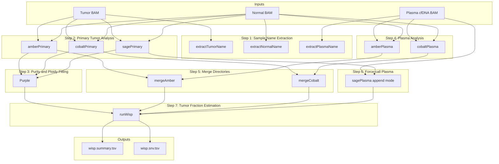

# wisp

WISP tumor fraction estimation with chromosome-split SAGE plasma append

## Overview


### Inputs
The workflow requires three inputs: a primary tumor sample, a matched normal sample (for germline filtering), and a plasma/cfDNA sample from the same patient. By first characterizing the somatic landscape of the primary tumor, the workflow can then quantify the fraction of cell-free DNA in plasma that originates from tumor cells.
### Workflow Description
* The pipeline proceeds through seven major steps:
* Sample Preparation: 
Sample names are extracted from BAM headers using GATK GetSampleName to ensure consistent naming across all downstream tools.
* Primary Tumor Characterization: 
Three tools run in parallel on the tumor-normal pair. AMBER calculates B-allele frequencies at known heterozygous germline SNP positions. COBALT measures read depth ratios across the genome for copy number analysis. SAGE performs somatic variant calling to identify SNVs and small indels present in the tumor (Note SAGE running on primary is implemented in separate SAGE workflow: https://github.com/oicr-gsi/sage).
* Purity and Ploidy Estimation: Purple integrates AMBER, COBALT, and SAGE outputs to estimate tumor purity, overall ploidy, and genome-wide copy number segments. This establishes the reference somatic profile for the primary tumor.
* Plasma Sample Processing: AMBER and COBALT are run on the plasma sample against the same matched normal, generating allele frequency and read depth data from the cfDNA.
Data Integration: AMBER and COBALT outputs from both primary and plasma analyses are merged into unified directories, as WISP requires data from both samples for comparison.
* Variant Force-Calling: SAGE runs in append mode on the plasma sample, force-calling read evidence at variant positions identified in the primary tumor rather than performing de novo variant discovery. This produces a VCF containing read counts from all three samples (normal, tumor, and plasma) at each somatic variant position.
* Tumor Fraction Estimation: WISP integrates all upstream outputs to estimate the ctDNA fraction. It examines variant allele frequencies in the plasma at known somatic variant sites and compares observed signals against expected values based on the primary tumor's copy number profile and variant characteristics.
### Outputs
The workflow produces a summary file containing the estimated tumor fraction and per-variant results detailing the evidence at each somatic position used in the estimation.

### Requirements
The workflow requires whole-genome sequencing data with sufficient coverage across the genome. Chromosome-subset or targeted panel data will not produce valid copy number estimates required for tumor fraction calculation.

## Dependencies

* [PURPLE](https://github.com/hartwigmedical/hmftools/blob/master/purple/README.md)
* [AMBER](https://github.com/hartwigmedical/hmftools/blob/master/amber/README.md)
* [COBALT](https://github.com/hartwigmedical/hmftools/blob/master/cobalt/README.md)
* [WISP](https://github.com/hartwigmedical/hmftools/tree/master/wisp)
* [SAGE](https://github.com/hartwigmedical/hmftools/tree/master/sage)


## Usage

### Cromwell
```
java -jar cromwell.jar run wisp.wdl --inputs inputs.json
```

### Inputs

#### Required workflow parameters:
Parameter|Value|Description
---|---|---
`tumour_bam`|File|Input tumor file (bam) of primary sample
`tumour_bai`|File|Input tumor file index (bai) of primary sample
`normal_bam`|File|Input normal file (bam) of primary sample
`normal_bai`|File|Input normal file index (bai) of primary sample
`plasma_bam`|File|Input of bam file of plasma from same donor as primary sample
`plasma_bai`|File|Input of bam index file of plasma from same donor
`donor`|String|Patient identifier
`sage_primary_vcf`|File|Pre-computed SAGE VCF from primary tumor/normal run
`sage_primary_vcf_index`|File|Index for pre-computed SAGE VCF


#### Optional workflow parameters:
Parameter|Value|Default|Description
---|---|---|---
`genomeVersion`|String|"38"|Genome Version, only 38 supported
`chromosomes`|Array[String]|["chr1", "chr2", "chr3", "chr4", "chr5", "chr6", "chr7", "chr8", "chr9", "chr10", "chr11", "chr12", "chr13", "chr14", "chr15", "chr16", "chr17", "chr18", "chr19", "chr20", "chr21", "chr22,chrX,chrY"]|List of chromosomes to process in parallel


#### Optional task parameters:
Parameter|Value|Default|Description
---|---|---|---
`extractTumorName.memory`|Int|4|Memory allocated for this job (GB)
`extractTumorName.timeout`|Int|4|Hours before task timeout
`extractNormalName.memory`|Int|4|Memory allocated for this job (GB)
`extractNormalName.timeout`|Int|4|Hours before task timeout
`extractPlasmaName.memory`|Int|4|Memory allocated for this job (GB)
`extractPlasmaName.timeout`|Int|4|Hours before task timeout
`splitPonByChromosome.memory`|Int|4|Memory allocated for this job (GB)
`splitPonByChromosome.timeout`|Int|10|Hours before task timeout
`amberPrimaryChr.amberScript`|String|"java -Xmx32G -cp $HMFTOOLS_ROOT/amber.jar com.hartwig.hmftools.amber.AmberApplication"|location of AMBER script
`amberPrimaryChr.min_mapping_quality`|Int|30|Minimum mapping quality for an alignment to be used
`amberPrimaryChr.min_base_quality`|Int|25|Minimum quality for a base to be considered
`amberPrimary.memory`|Int|8|Memory allocated for this job (GB)
`amberPrimary.timeout`|Int|10|Hours before task timeout
`cobaltPrimary.colbaltScript`|String|"java -Xmx8G -cp $HMFTOOLS_ROOT/cobalt.jar com.hartwig.hmftools.cobalt.CobaltApplication"|location of COBALT script
`cobaltPrimary.gamma`|String|"300"|gamma (penalty) value for segmenting
`cobaltPrimary.min_mapping_quality`|Int|30|Minimum mapping quality for an alignment to be used
`cobaltPrimary.threads`|Int|8|Requested CPU threads
`cobaltPrimary.memory`|Int|32|Memory allocated for this job (GB)
`cobaltPrimary.timeout`|Int|100|Hours before task timeout
`purple.solution_name`|String|"Primary"|Name of solution
`purple.outfilePrefix`|String|tumour_name + ".sol" + solution_name|Prefix of output file
`purple.min_diploid_tumor_ratio_count`|Int|60|smooth over contiguous segments
`purple.purpleScript`|String|"java -Xmx8G -jar $HMFTOOLS_ROOT/purple.jar"|location of PURPLE script
`purple.min_ploidy`|String?|None|minimum ploidy to consider
`purple.max_ploidy`|String?|None|maximum ploidy to consider
`purple.min_purity`|String?|None|minimum purity to consider
`purple.max_purity`|String?|None|maximum purity to consider
`purple.ploidy_penalty_factor`|String?|None|ploidy penalty factor
`purple.ploidy_penalty_standard_deviation`|String?|None|ploidy penalty standard deviation
`purple.threads`|Int|8|Requested CPU threads
`purple.memory`|Int|32|Memory allocated for this job (GB)
`purple.timeout`|Int|100|Hours before task timeout
`amberPlasmaChr.amberScript`|String|"java -Xmx32G -cp $HMFTOOLS_ROOT/amber.jar com.hartwig.hmftools.amber.AmberApplication"|location of AMBER script
`amberPlasmaChr.min_mapping_quality`|Int|30|Minimum mapping quality for an alignment to be used
`amberPlasmaChr.min_base_quality`|Int|25|Minimum quality for a base to be considered
`amberPlasma.memory`|Int|8|Memory allocated for this job (GB)
`amberPlasma.timeout`|Int|10|Hours before task timeout
`cobaltPlasma.colbaltScript`|String|"java -Xmx8G -cp $HMFTOOLS_ROOT/cobalt.jar com.hartwig.hmftools.cobalt.CobaltApplication"|location of COBALT script
`cobaltPlasma.gamma`|String|"300"|gamma (penalty) value for segmenting
`cobaltPlasma.min_mapping_quality`|Int|30|Minimum mapping quality for an alignment to be used
`cobaltPlasma.threads`|Int|8|Requested CPU threads
`cobaltPlasma.memory`|Int|32|Memory allocated for this job (GB)
`cobaltPlasma.timeout`|Int|100|Hours before task timeout
`sage.min_map_quality`|Int|10|Minimum mapping quality
`sage.hard_min_tumor_qual`|Int|50|Hard minimum tumor quality
`sage.hard_min_tumor_raw_alt_support`|Int|2|Minimum raw alt support
`sage.hard_min_tumor_vaf`|Float|0.002|Minimum tumor VAF
`sage.threads`|Int|8|Requested CPU threads
`sage.memory`|Int|40|Memory allocated for this job (GB)
`sage.timeout`|Int|24|Hours before task timeout
`mergePlasmaVcfs.memory`|Int|8|Memory allocated for this job (GB)
`mergePlasmaVcfs.timeout`|Int|4|Hours before task timeout
`mergePlasmaBqr.memory`|Int|4|Memory allocated for this job (GB)
`mergePlasmaBqr.timeout`|Int|2|Hours before task timeout
`runWisp.threads`|Int|4|Requested CPU threads
`runWisp.memory`|Int|16|Memory allocated for this job (GB)
`runWisp.timeout`|Int|50|Hours before task timeout


### Outputs

Output | Type | Description | Labels
---|---|---|---
`wisp_directory`|File|Zipped WISP output directory|
`wisp_summary`|File|WISP tumor fraction summary|
`wisp_snv_results`|File?|Per-variant SNV results|
`sage_plasma_vcf`|File|SAGE VCF with plasma sample appended|
`sage_plasma_vcf_index`|File|Index for SAGE plasma VCF|
`sage_plasma_bqr`|File|Zipped SAGE BQR results directory for plasma|

## Commands
This section lists command(s) run by wisp workflow

* Running wisp

```
    set -euo pipefail

    if [ -f "~{inputBam}" ]; then
      gatk --java-options "-Xmx1g" GetSampleName -R ~{refFasta} -I ~{inputBam} -O input_name.txt -encode
    fi

    cat input_name.txt
```
```
    set -euo pipefail
    
    # Extract just this chromosome from PON
    bcftools view -r ~{chromosome} ~{PON} -O z -o pon.~{chromosome}.vcf.gz
    tabix -p vcf pon.~{chromosome}.vcf.gz
```
```
    set -euo pipefail

    mkdir ~{file_prefix}.amber  

    ~{amberScript} \
      -reference ~{normal_name} -reference_bam ~{normal_bam} \
      -tumor ~{tumour_name} -tumor_bam ~{tumour_bam} \
      -output_dir ~{file_prefix}.amber/ \
      -loci ~{PON} \
      -ref_genome_version ~{genomeVersion} \
      -min_mapping_quality ~{min_mapping_quality} \
      -min_base_quality ~{min_base_quality} 

    zip -r ~{file_prefix}.amber.zip ~{file_prefix}.amber/

```
```
    set -euo pipefail

    mkdir -p ~{tumour_name}.amber
    mkdir -p temp

    # Unzip all chromosome results
    for zip_file in ~{sep=' ' chr_zips}; do
      unzip -o ${zip_file} -d temp/
    done

    # Get first file without using head in subshell
    first_baf=$(ls temp/*/*.amber.baf.tsv.gz | sort -V | sed -n '1p')
    zcat "$first_baf" | sed -n '1p' > temp_header.txt
    zcat temp/*/*.amber.baf.tsv.gz | grep -v "^chromosome" | sort -k1,1V -k2,2n > temp_data.txt
    cat temp_header.txt temp_data.txt | gzip > ~{tumour_name}.amber/~{tumour_name}.amber.baf.tsv.gz
    rm temp_header.txt temp_data.txt

    # Use sed instead of head for other merges too
    first_pcf=$(ls temp/*/*.amber.baf.pcf | sort -V | sed -n '1p')
    sed -n '1p' "$first_pcf" > temp_header_pcf.txt
    tail -q -n +2 temp/*/*.amber.baf.pcf | sort -k2,2V -k4,4n > temp_data_pcf.txt
    cat temp_header_pcf.txt temp_data_pcf.txt > ~{tumour_name}.amber/~{tumour_name}.amber.baf.pcf
    rm temp_header_pcf.txt temp_data_pcf.txt

    cp $(find temp -name "*.amber.qc" -type f | sed -n '1p') ~{tumour_name}.amber/~{tumour_name}.amber.qc

    if ls temp/*/*.amber.contamination.tsv 1> /dev/null 2>&1; then
      {
        head -n1 $(ls temp/*/*.amber.contamination.tsv | sort -V | head -n1)
        tail -q -n +2 temp/*/*.amber.contamination.tsv | sort -k1,1V -k2,2n
      } > ~{tumour_name}.amber/~{tumour_name}.amber.contamination.tsv
    fi

    if ls temp/*/*.amber.contamination.vcf.gz 1> /dev/null 2>&1; then
      bcftools concat $(ls temp/*/*.amber.contamination.vcf.gz | sort -V) | \
        bcftools sort -O z -o ~{tumour_name}.amber/~{tumour_name}.amber.contamination.vcf.gz
      tabix -p vcf ~{tumour_name}.amber/~{tumour_name}.amber.contamination.vcf.gz
    fi

    if ls temp/*/*.amber.homozygousregion.tsv 1> /dev/null 2>&1; then
      {
        head -n1 $(ls temp/*/*.amber.homozygousregion.tsv | sort -V | head -n1)
        tail -q -n +2 temp/*/*.amber.homozygousregion.tsv | sort -k1,1V -k2,2n
      } > ~{tumour_name}.amber/~{tumour_name}.amber.homozygousregion.tsv
    fi

    if find temp -name "amber.version" -type f | grep -q .; then
      cp $(find temp -name "amber.version" -type f | head -n1) ~{tumour_name}.amber/amber.version
    fi

    zip -r ~{tumour_name}.amber.zip ~{tumour_name}.amber/
```
```
    set -euo pipefail

    mkdir ~{tumour_name}.cobalt 

    ~{colbaltScript} \
      -reference ~{normal_name} -reference_bam ~{normal_bam} \
      -tumor ~{tumour_name} -tumor_bam ~{tumour_bam} \
      -output_dir ~{tumour_name}.cobalt/ \
      -gc_profile ~{gcProfile} \
      -pcf_gamma ~{gamma} \
      -min_quality ~{min_mapping_quality}

    zip -r ~{tumour_name}.cobalt.zip ~{tumour_name}.cobalt/

```
```
    mkdir -p ~{output_name}
    unzip -o ~{primary_zip} -d ~{output_name}/
    unzip -o ~{plasma_zip} -d ~{output_name}/
    # Flatten if nested
    find ~{output_name} -mindepth 2 -type f -exec mv {} ~{output_name}/ \;
    find ~{output_name} -mindepth 1 -type d -empty -delete
    zip -r ~{output_name}.zip ~{output_name}/
```
```
    set -euo pipefail
    
    mkdir -p ~{reference_name}.sage.bqr
    
    sage_jar="/.mounts/labs/gsiprojects/gsi/gsiusers/gpeng/dev/sage/sage_v3.4.4.jar"
    
    java -Xmx32G -cp ${sage_jar} com.hartwig.hmftools.sage.append.SageAppendApplication \
      -reference ~{reference_name} \
      -reference_bam ~{reference_bam} \
      -ref_genome_version 38 \
      -ref_genome ~{refFasta} \
      -input_vcf ~{input_vcf} \
      -specific_chr ~{chromosome} \
      -output_vcf ~{reference_name}.~{chromosome}.sage.vcf.gz \
      -threads ~{threads} \
      -min_map_quality ~{min_map_quality} \
      -hard_min_tumor_qual ~{hard_min_tumor_qual} \
      -hard_min_tumor_raw_alt_support ~{hard_min_tumor_raw_alt_support} \
      -hard_min_tumor_vaf ~{hard_min_tumor_vaf}

    mv *.sage.bqr.tsv ~{reference_name}.sage.bqr/ 2>/dev/null || true
    zip -r ~{reference_name}.~{chromosome}.sage.bqr.zip ~{reference_name}.sage.bqr/

```
```
    set -euo pipefail
    
    # Create file list for bcftools concat
    for vcf in ~{sep=' ' vcfs}; do
      echo "$vcf" >> vcf_list.txt
    done
    
    # Sort by chromosome order
    sort -V vcf_list.txt > vcf_list_sorted.txt
    
    # Concatenate VCFs in order
    bcftools concat \
      --file-list vcf_list_sorted.txt \
      --output-type z \
      --output ~{sample_name}.sage.vcf.gz
    
    # Index the merged VCF
    tabix -p vcf ~{sample_name}.sage.vcf.gz
```
```
    set -euo pipefail
    
    mkdir -p ~{sample_name}.sage.bqr
    
    # Unzip all BQR files into the same directory
    for bqr_zip in ~{sep=' ' bqr_zips}; do
      unzip -o "$bqr_zip" -d temp_bqr/
    done
    
    # Move all .tsv files to final directory
    find temp_bqr -name "*.sage.bqr.tsv" -exec mv {} ~{sample_name}.sage.bqr/ \;
    
    # Zip the merged directory
    zip -r ~{sample_name}.sage.bqr.zip ~{sample_name}.sage.bqr/
```
```
    set -euo pipefail

    # Unzip input directories
    unzip ~{purple_dir}
    unzip ~{amber_dir}
    unzip ~{cobalt_dir}
    unzip ~{bqr_dir}

    # Create output directory
    mkdir -p ~{plasma_name}.wisp

    # Run WISP
    java -Xmx16G -jar $WISP_ROOT/wisp.jar \
      -patient_id ~{donor} \
      -tumor_id ~{tumour_name} \
      -samples ~{plasma_name} \
      -purple_dir ~{tumour_name}.solPrimary.purple/ \
      -amber_dir merged_amber/ \
      -cobalt_dir merged_cobalt/ \
      -somatic_vcf ~{somatic_vcf} \
      -bqr_dir ~{plasma_name}.sage.bqr/ \
      -ref_genome ~{refFasta} \
      -output_dir ~{plasma_name}.wisp/ \
      -threads ~{threads}

    # Zip output
    zip -r ~{plasma_name}.wisp.zip ~{plasma_name}.wisp/

```
```
    set -euo pipefail

    unzip ~{amber_directory} 
    unzip ~{cobalt_directory} 
    mkdir ~{outfilePrefix}.purple 

    ~{purpleScript} \
      -ref_genome_version ~{genomeVersion} \
      -ref_genome ~{refFasta}  \
      -gc_profile ~{gcProfile} \
      -ensembl_data_dir ~{ensemblDir}  \
      -reference ~{normal_name} -tumor ~{tumour_name}  \
      -amber ~{tumour_name}.amber -cobalt ~{tumour_name}.cobalt \
      ~{"-ploidy_penalty_factor " + ploidy_penalty_factor} \
      ~{"-ploidy_penalty_standard_deviation " + ploidy_penalty_standard_deviation} \
      ~{"-somatic_vcf " + somatic_vcf} \
      ~{"-min_ploidy " + min_ploidy} \
      ~{"-max_ploidy " + max_ploidy} \
      ~{"-min_purity " + min_purity} \
      ~{"-max_purity " + max_purity} \
      -no_charts \
      -min_diploid_tumor_ratio_count ~{min_diploid_tumor_ratio_count} \
      -output_dir ~{outfilePrefix}.purple 

    zip -r ~{outfilePrefix}.purple.zip ~{outfilePrefix}.purple/

```

## Support

For support, please file an issue on the [Github project](https://github.com/oicr-gsi) or send an email to gsi@oicr.on.ca .

_Generated with generate-markdown-readme (https://github.com/oicr-gsi/gsi-wdl-tools/)_
