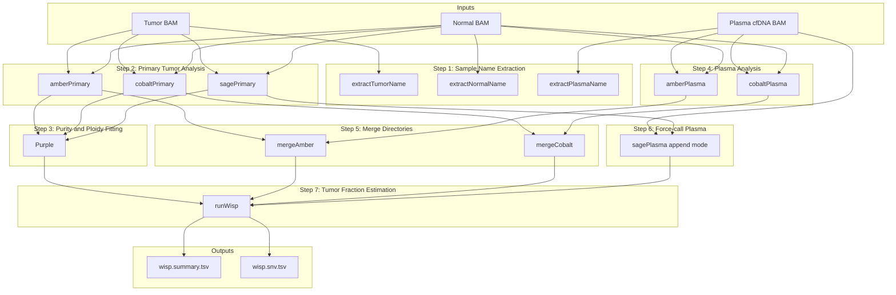

# wisp

The WISP (Whole-genome Inference of Somatic Plasma) workflow estimates circulating tumor DNA (ctDNA) fraction in plasma samples by leveraging somatic variants and copy number profiles derived from matched primary tumor sequencing data.

## Overview


### Inputs
The workflow requires three inputs: a primary tumor sample, a matched normal sample (for germline filtering), and a plasma/cfDNA sample from the same patient. By first characterizing the somatic landscape of the primary tumor, the workflow can then quantify the fraction of cell-free DNA in plasma that originates from tumor cells.
### Workflow Description
* The pipeline proceeds through seven major steps:
* Sample Preparation: 
Sample names are extracted from BAM headers using GATK GetSampleName to ensure consistent naming across all downstream tools.
* Primary Tumor Characterization: 
Three tools run in parallel on the tumor-normal pair. AMBER calculates B-allele frequencies at known heterozygous germline SNP positions. COBALT measures read depth ratios across the genome for copy number analysis. SAGE performs somatic variant calling to identify SNVs and small indels present in the tumor.
* Purity and Ploidy Estimation: Purple integrates AMBER, COBALT, and SAGE outputs to estimate tumor purity, overall ploidy, and genome-wide copy number segments. This establishes the reference somatic profile for the primary tumor.
* Plasma Sample Processing: AMBER and COBALT are run on the plasma sample against the same matched normal, generating allele frequency and read depth data from the cfDNA.
Data Integration: AMBER and COBALT outputs from both primary and plasma analyses are merged into unified directories, as WISP requires data from both samples for comparison.
* Variant Force-Calling: SAGE runs in append mode on the plasma sample, force-calling read evidence at variant positions identified in the primary tumor rather than performing de novo variant discovery. This produces a VCF containing read counts from all three samples (normal, tumor, and plasma) at each somatic variant position.
* Tumor Fraction Estimation: WISP integrates all upstream outputs to estimate the ctDNA fraction. It examines variant allele frequencies in the plasma at known somatic variant sites and compares observed signals against expected values based on the primary tumor's copy number profile and variant characteristics.
### Outputs
The workflow produces a summary file containing the estimated tumor fraction and per-variant results detailing the evidence at each somatic position used in the estimation.

### Requirements
The workflow requires whole-genome sequencing data with sufficient coverage across the genome. Chromosome-subset or targeted panel data will not produce valid copy number estimates required for tumor fraction calculation.


## Dependencies

* [PURPLE](https://github.com/hartwigmedical/hmftools/blob/master/purple/README.md)
* [AMBER](https://github.com/hartwigmedical/hmftools/blob/master/amber/README.md)
* [COBALT](https://github.com/hartwigmedical/hmftools/blob/master/cobalt/README.md)
* [bcftools](https://www.htslib.org/doc/1.9/bcftools.html)
* [wisp](https://github.com/hartwigmedical/hmftools/tree/master/wisp)
* [sage](https://github.com/hartwigmedical/hmftools/tree/master/sage)


## Usage

### Cromwell
```
java -jar cromwell.jar run wisp.wdl --inputs inputs.json
```

### Inputs

#### Required workflow parameters:
Parameter|Value|Description
---|---|---
`tumour_bam`|File|Input tumor file (bam) of primary sample
`tumour_bai`|File|Input tumor file index (bai) of primary sample
`normal_bam`|File|Input normal file (bam) of primary sample
`normal_bai`|File|Input normal file index (bai) of primary sample
`plasma_bam`|File|Input of bam file of plasma from same donor as primary sample
`plasma_bai`|File|Input of bam index file of plasma from same donor
`donor`|String|The donor of all the samples


#### Optional workflow parameters:
Parameter|Value|Default|Description
---|---|---|---
`genomeVersion`|String|"38"|Genome Version, only 38 supported


#### Optional task parameters:
Parameter|Value|Default|Description
---|---|---|---
`extractTumorName.memory`|Int|4|Memory allocated for this job (GB)
`extractTumorName.timeout`|Int|4|Hours before task timeout
`extractNormalName.memory`|Int|4|Memory allocated for this job (GB)
`extractNormalName.timeout`|Int|4|Hours before task timeout
`extractPlasmaName.memory`|Int|4|Memory allocated for this job (GB)
`extractPlasmaName.timeout`|Int|4|Hours before task timeout
`amberPrimary.amberScript`|String|"java -Xmx32G -cp $HMFTOOLS_ROOT/amber.jar com.hartwig.hmftools.amber.AmberApplication"|location of AMBER script
`amberPrimary.min_mapping_quality`|Int|30|Minimum mapping quality for an alignment to be used
`amberPrimary.min_base_quality`|Int|25|Minimum quality for a base to be considered
`amberPrimary.threads`|Int|8|Requested CPU threads
`amberPrimary.memory`|Int|32|Memory allocated for this job (GB)
`amberPrimary.timeout`|Int|100|Hours before task timeout
`cobaltPrimary.colbaltScript`|String|"java -Xmx8G -cp $HMFTOOLS_ROOT/cobalt.jar com.hartwig.hmftools.cobalt.CobaltApplication"|location of COBALT script
`cobaltPrimary.gamma`|String|300|gamma (penalty) value for segmenting
`cobaltPrimary.min_mapping_quality`|Int|30|Minimum mapping quality for an alignment to be used
`cobaltPrimary.threads`|Int|8|Requested CPU threads
`cobaltPrimary.memory`|Int|32|Memory allocated for this job (GB)
`cobaltPrimary.timeout`|Int|100|Hours before task timeout
`sagePrimary.input_vcf`|File?|None|Input VCF for append mode (optional)
`sagePrimary.min_map_quality`|Int|10|Minimum mapping quality
`sagePrimary.hard_min_tumor_qual`|Int|50|Hard minimum tumor quality
`sagePrimary.hard_min_tumor_raw_alt_support`|Int|2|Minimum raw alt support
`sagePrimary.hard_min_tumor_vaf`|Float|0.002|Minimum tumor VAF
`sagePrimary.threads`|Int|8|Requested CPU threads
`sagePrimary.memory`|Int|40|Memory allocated for this job (GB)
`sagePrimary.timeout`|Int|100|Hours before task timeout
`purple.solution_name`|String|"Primary"|Name of solution
`purple.outfilePrefix`|String|tumour_name + ".sol" + solution_name|Prefix of output file
`purple.min_diploid_tumor_ratio_count`|Int|60|smooth over contiguous segments which are fewer than this number of depth windows long and which have no SV support on either side and which are bounded on both sides by copy number regions which could be smoothed together using our normal smoothing rules.
`purple.purpleScript`|String|"java -Xmx8G -jar $HMFTOOLS_ROOT/purple.jar"|location of PURPLE script
`purple.min_ploidy`|String?|None|minimum ploidy
`purple.max_ploidy`|String?|None|max ploidy
`purple.min_purity`|String?|None|mininimum purity
`purple.max_purity`|String?|None|max purity
`purple.ploidy_penalty_factor`|String?|None|multiplies aggregate event penalty by this factor
`purple.ploidy_penalty_standard_deviation`|String?|None|not entirely sure what this does
`purple.threads`|Int|8|Requested CPU threads
`purple.memory`|Int|32|Memory allocated for this job (GB)
`purple.timeout`|Int|100|Hours before task timeout
`amberPlasma.amberScript`|String|"java -Xmx32G -cp $HMFTOOLS_ROOT/amber.jar com.hartwig.hmftools.amber.AmberApplication"|location of AMBER script
`amberPlasma.min_mapping_quality`|Int|30|Minimum mapping quality for an alignment to be used
`amberPlasma.min_base_quality`|Int|25|Minimum quality for a base to be considered
`amberPlasma.threads`|Int|8|Requested CPU threads
`amberPlasma.memory`|Int|32|Memory allocated for this job (GB)
`amberPlasma.timeout`|Int|100|Hours before task timeout
`cobaltPlasma.colbaltScript`|String|"java -Xmx8G -cp $HMFTOOLS_ROOT/cobalt.jar com.hartwig.hmftools.cobalt.CobaltApplication"|location of COBALT script
`cobaltPlasma.gamma`|String|300|gamma (penalty) value for segmenting
`cobaltPlasma.min_mapping_quality`|Int|30|Minimum mapping quality for an alignment to be used
`cobaltPlasma.threads`|Int|8|Requested CPU threads
`cobaltPlasma.memory`|Int|32|Memory allocated for this job (GB)
`cobaltPlasma.timeout`|Int|100|Hours before task timeout
`sagePlasma.tumour_name`|String?|None|Name for Tumour sample
`sagePlasma.tumour_bam`|File?|None|Tumour bam
`sagePlasma.tumour_bai`|File?|None|Matching bai for Tumour bam
`sagePlasma.min_map_quality`|Int|10|Minimum mapping quality
`sagePlasma.hard_min_tumor_qual`|Int|50|Hard minimum tumor quality
`sagePlasma.hard_min_tumor_raw_alt_support`|Int|2|Minimum raw alt support
`sagePlasma.hard_min_tumor_vaf`|Float|0.002|Minimum tumor VAF
`sagePlasma.threads`|Int|8|Requested CPU threads
`sagePlasma.memory`|Int|40|Memory allocated for this job (GB)
`sagePlasma.timeout`|Int|100|Hours before task timeout
`runWisp.threads`|Int|4|Requested CPU threads
`runWisp.memory`|Int|16|Memory allocated for this job (GB)
`runWisp.timeout`|Int|50|Hours before task timeout


### Outputs

Output | Type | Description | Labels
---|---|---|---
`wisp_directory`|File|Zipped WISP output directory|
`wisp_summary`|File|WISP tumor fraction summary|
`wisp_snv_results`|File|Per-variant SNV results|


## Commands
 This section lists command(s) run by WISP workflow
 
 * Running WISP
 
 The WISP (Whole-genome Inference of Somatic Plasma) workflow estimates circulating tumor DNA (ctDNA) fraction in plasma samples by leveraging somatic variants and copy number profiles derived from matched primary tumor sequencing data.
 
 ```
     set -euo pipefail
 
     if [ -f "~{inputBam}" ]; then
       gatk --java-options "-Xmx1g" GetSampleName -R ~{refFasta} -I ~{inputBam} -O input_name.txt -encode
     fi
 
     cat input_name.txt
 ```
 ```
     set -euo pipefail
 
     mkdir ~{tumour_name}.amber  
 
     ~{amberScript} \
       -reference ~{normal_name} -reference_bam ~{normal_bam} \
       -tumor ~{tumour_name} -tumor_bam ~{tumour_bam} \
       -output_dir ~{tumour_name}.amber/ \
       -loci ~{PON} \
       -ref_genome_version ~{genomeVersion} \
       -min_mapping_quality ~{min_mapping_quality} \
       -min_base_quality ~{min_base_quality} 
 
     zip -r ~{tumour_name}.amber.zip ~{tumour_name}.amber/
 
 ```
 ```
     set -euo pipefail
 
     mkdir ~{tumour_name}.cobalt 
 
     ~{colbaltScript} \
       -reference ~{normal_name} -reference_bam ~{normal_bam} \
       -tumor ~{tumour_name} -tumor_bam ~{tumour_bam} \
       -output_dir ~{tumour_name}.cobalt/ \
       -gc_profile ~{gcProfile} \
       -pcf_gamma ~{gamma} \
       -min_quality ~{min_mapping_quality}
 
     zip -r ~{tumour_name}.cobalt.zip ~{tumour_name}.cobalt/
 
 ```
 ```
     mkdir -p ~{output_name}
     unzip -o ~{primary_zip} -d ~{output_name}/
     unzip -o ~{plasma_zip} -d ~{output_name}/
     # Flatten if nested
     find ~{output_name} -mindepth 2 -type f -exec mv {} ~{output_name}/ \;
     find ~{output_name} -mindepth 1 -type d -empty -delete
     zip -r ~{output_name}.zip ~{output_name}/
 ```
 ```
     set -euo pipefail
     mkdir -p ~{tumour_name}.sage.bqr 
 
     if ~{append_mode}; then
         sageClass="com.hartwig.hmftools.sage.append.SageAppendApplication"
     else
         sageClass="com.hartwig.hmftools.sage.SageApplication"
     fi
     sage_jar="/.mounts/labs/gsiprojects/gsi/gsiusers/gpeng/dev/sage/sage_v3.4.4.jar"
     
   
     java -Xmx32G -cp ${sage_jar} ${sageClass}   \
       ~{if append_mode then "" else "-tumor " + tumour_name} \
       ~{if append_mode then "" else "-tumor_bam " + tumour_bam} \
       -reference ~{reference_name} \
       -reference_bam ~{reference_bam} \
       -ref_genome_version 38 \
       -ref_genome ~{refFasta} \
       ~{"-input_vcf " + input_vcf} \
       ~{if !defined(input_vcf) then "-ensembl_data_dir " + ensemblDir else ""} \
       ~{if !defined(input_vcf) then "-high_confidence_bed " + highConfBed else ""} \
       ~{if !defined(input_vcf) then "-hotspots " + hotspots else ""} \
       -output_vcf ~{tumour_name}.sage.vcf.gz \
       -threads ~{threads} \
       -min_map_quality ~{min_map_quality} \
       -hard_min_tumor_qual ~{hard_min_tumor_qual} \
       -hard_min_tumor_raw_alt_support ~{hard_min_tumor_raw_alt_support} \
       -hard_min_tumor_vaf ~{hard_min_tumor_vaf}
 
     mv *.sage.bqr.tsv ~{tumour_name}.sage.bqr/ 2>/dev/null || true
     zip -r ~{tumour_name}.sage.bqr.zip ~{tumour_name}.sage.bqr/
 
 ```
 ```
     set -euo pipefail
 
     # Unzip input directories
     unzip ~{purple_dir}
     unzip ~{amber_dir}
     unzip ~{cobalt_dir}
     unzip ~{bqr_dir}
 
     # Create output directory
     mkdir -p ~{plasma_name}.wisp
 
     # Run WISP
     java -Xmx16G -jar $WISP_ROOT/wisp.jar \
       -patient_id ~{donor} \
       -tumor_id ~{tumour_name} \
       -samples ~{plasma_name} \
       -purple_dir ~{tumour_name}.solPrimary.purple/ \
       -amber_dir "merged_amber"/ \
       -cobalt_dir "merged_cobalt"/ \
       -somatic_vcf ~{somatic_vcf} \
       -bqr_dir ~{plasma_name}.sage.bqr/ \
       -ref_genome ~{refFasta} \
       -output_dir ~{plasma_name}.wisp/ \
       -threads ~{threads}
 
     # Zip output
     zip -r ~{plasma_name}.wisp.zip ~{plasma_name}.wisp/
 
 ```
 ```
     set -euo pipefail
 
     unzip ~{amber_directory} 
     unzip ~{cobalt_directory} 
     mkdir ~{outfilePrefix}.purple 
 
     ~{purpleScript} \
       -ref_genome_version ~{genomeVersion} \
       -ref_genome ~{refFasta}  \
       -gc_profile ~{gcProfile} \
       -ensembl_data_dir ~{ensemblDir}  \
       -reference ~{normal_name} -tumor ~{tumour_name}  \
       -amber ~{tumour_name}.amber -cobalt ~{tumour_name}.cobalt \
       ~{"-ploidy_penalty_factor" + ploidy_penalty_factor} \
       ~{"-ploidy_penalty_standard_deviation" + ploidy_penalty_standard_deviation} \
       ~{"-somatic_vcf " + somatic_vcf} \
       ~{"-min_ploidy " + min_ploidy} \
       ~{"-max_ploidy " + max_ploidy} \
       ~{"-min_purity " + min_purity} \
       ~{"-max_purity " + max_purity} \
       -no_charts \
       -min_diploid_tumor_ratio_count ~{min_diploid_tumor_ratio_count} \
       -output_dir ~{outfilePrefix}.purple 
 
     zip -r ~{outfilePrefix}.purple.zip ~{outfilePrefix}.purple/
 
 ```
 ## Support

For support, please file an issue on the [Github project](https://github.com/oicr-gsi) or send an email to gsi@oicr.on.ca .

_Generated with generate-markdown-readme (https://github.com/oicr-gsi/gsi-wdl-tools/)_
