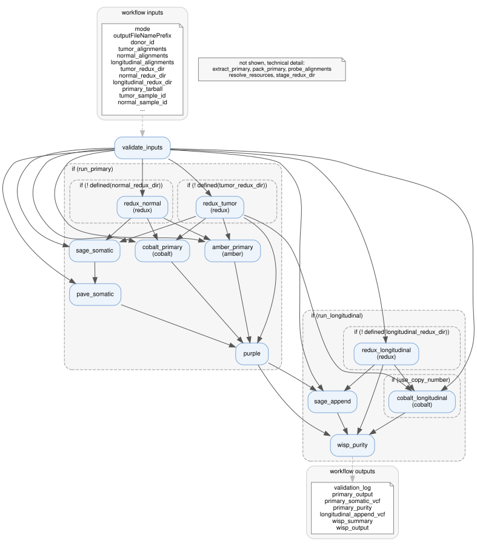

# wisp

## Overview



SNV-based MRD detection with the Hartwig WiGiTS tools, run as discrete tasks rather than through a pipeline engine.

The chart is a declaration-level view: every box is one Cromwell task running one tool in its own container, and the dashed clusters are the mode conditionals. Tasks that only prepare or check inputs are hidden -- `resolve_resources`, `probe_alignments`, `validate_inputs`, `stage_redux_dir`, `extract_primary`, `pack_primary`. Diagram source is Graphviz, in docs/.

A primary tumour is called against its matched normal and fitted with PURPLE, producing a somatic call set. A longitudinal (plasma) sample is then force-called at exactly those sites and WISP estimates the tumour fraction they support. Copy-number and LOH evidence are deliberately out of scope: WISP is asked for SOMATIC_VARIANT and, optionally, COPY_NUMBER.

## Modes

| mode | inputs | produces |
|---|---|---|
| `WG` | `tumor_alignments`, `normal_alignments` | `primary_output` tarball for later `PE` runs |
| `PE` | `longitudinal_alignments`, `primary_tarball` | `wisp_summary`, `wisp_output` |
| `WG_PE` | all three alignment sets | both, in sequence |

`normal_alignments` is mandatory for `WG` and `WG_PE`, with no override. Without a matched normal SAGE cannot subtract germline variants, the somatic call set fills with germline sites, and WISP measures those in the patient's own cfDNA and reports a large spurious tumour fraction.

Run `WG` once per primary and `PE` once per timepoint. `WG_PE` suits a single-timepoint case, where re-running the primary costs nothing extra.

## Inputs the alignments must satisfy

Several properties are read from the alignments and checked before any expensive task runs, because getting them wrong produces a plausible but wrong answer rather than a failure:

- **The tumour and the normal must share a sequencing platform.** AMBER and SAGE are each given both in one call and take a single platform. The longitudinal sample is only ever processed on its own, so it may differ -- an Illumina primary with an Ultima plasma is a valid run, and each sample is then processed with its own error model while the site list still comes from the primary. Set `sequencing_platform` and `longitudinal_sequencing_platform` to override what the read-group PL tags report.
- **Mate CIGAR (MC) tags must be present**, wherever REDUX is going to mark duplicates. Without them it marks them wrong and reports nothing unusual. Alignments produced by bwa-mem2 carry them. Ultima is exempt, its reads being single-ended, and so is a sample supplied as a REDUX directory.
- **The header must order the called contigs the same way the reference does.** The tools address a contig by its position in the alignment header, so a header sorted differently -- chr10 before chr2, as an alphabetically sorted reference produces -- makes them read the wrong contig and discard the evidence without failing. Only the relative order of the contigs the two have in common is checked, so a header carrying fewer decoys than the reference is fine; and a disagreement confined to the decoys that follow chr1..chrM is reported as a note rather than refused, because no variant is called there.

Alignments may be BAM or CRAM.

## Skipping REDUX

A sample that has already been through REDUX is supplied as `tumor_redux_dir`, `normal_redux_dir` or `longitudinal_redux_dir` instead of its alignments, and REDUX does not run for it. The directory must hold `{sample_id}.redux.bam` with its index and the recalibration, jitter and microsatellite tables, all named by the same prefix; that prefix has to equal what the alignment reports as its read-group SM tag, because the tools resolve the files by prefix but read the sample from the header. Each sample takes one route or the other, never both.

## Further samples in one run

Two inputs feed this, and they add up. `additional_redux_dirs` takes whole REDUX directories: every sample in each is estimated, which is the form a control pool usually wants. `additional_samples` names individual samples, for a subset of a pool or for samples spread across directories.

`additional_samples` takes samples to estimate alongside the longitudinal one: other timepoints from the same patient, or tumour-free controls that establish the background a result is read against. Each entry names a sample id and the REDUX output directory holding it, so several entries may share one directory, which is how a control pool is usually stored. Every sample is force-called at the primary's somatic sites in one SAGE append and estimated in one WISP call, and `wisp_summary` is that call's table, a row per sample. The cost of a run therefore barely changes with the number of samples. They are given as REDUX output rather than alignments because a control pool is reused across subjects and re-running REDUX over it each time is repeated work.

The tool takes one patient id for the whole invocation, so samples from another donor are labelled with this donor's id. That is a label rather than an input to the estimate, but it makes the summary misleading if controls come from elsewhere.

## Copy number

`use_copy_number` adds COPY_NUMBER to the purity methods WISP applies, at the cost of running COBALT on the longitudinal sample. Somatic-variant evidence alone is what the assay reports, so it is off by default and the flag exists to let the two be compared.

It cannot be combined with further samples, and a run that asks for both is refused before any tool starts. One WISP call measures every sample and takes one set of purity methods, while COBALT runs only on the longitudinal sample, so the further samples would be asked for copy-number evidence that was never produced.

## Dependencies

* [wisp 3.0.0](https://github.com/hartwigmedical/hmftools/tree/master/wisp)
* [apptainer 1.4.5](https://apptainer.org/)
* [hmftools-redux 2.0.5](https://github.com/hartwigmedical/hmftools/tree/master/redux)
* [hmftools-amber 4.3](https://github.com/hartwigmedical/hmftools/tree/master/amber)
* [hmftools-cobalt 3.0](https://github.com/hartwigmedical/hmftools/tree/master/cobalt)
* [hmftools-sage 5.0.2](https://github.com/hartwigmedical/hmftools/tree/master/sage)
* [hmftools-pave 1.9](https://github.com/hartwigmedical/hmftools/tree/master/pave)
* [hmftools-purple 4.4](https://github.com/hartwigmedical/hmftools/tree/master/purple)
* [hmftools-wisp 1.3.1](https://github.com/hartwigmedical/hmftools/tree/master/wisp)


## Usage

### Cromwell
```
java -jar cromwell.jar run wisp.wdl --inputs inputs.json
```

### Inputs

#### Required workflow parameters:
Parameter|Value|Description
---|---|---
`outputFileNamePrefix`|String|Prefix for the longitudinal-stage provisioned files, so runs of different samples do not provision the same name. Primary-stage files are named from the primary tumour sample id instead: one run can produce both, and naming a primary call set after the longitudinal sample reads as the wrong sample. The names the tools use among themselves always come from the sample ids
`donor_id`|String|Donor the samples came from, passed to WISP as patient_id and reported as a column of its summary. Groups a primary with every longitudinal sample drawn from the same donor, so it identifies the donor rather than the run


#### Optional workflow parameters:
Parameter|Value|Default|Description
---|---|---|---
`mode`|String|"WG_PE"|Which stages to run: WG (primary only, producing the tarball a later PE run consumes), PE (longitudinal sample against an existing primary tarball) or WG_PE (both in sequence)
`tumor_alignments`|Array[Alignment]?|None|Primary tumour alignments and indexes, BAM or CRAM, which REDUX merges and processes. Supply these or tumor_redux_dir, not both; one of the two is MANDATORY for WG and WG_PE
`normal_alignments`|Array[Alignment]?|None|Matched normal alignments and indexes, BAM or CRAM. One of these or normal_redux_dir is MANDATORY for WG and WG_PE, with no override. Without a matched normal SAGE cannot subtract germline variants, the somatic call set fills with germline sites, and WISP measures those in the patient's own cfDNA and reports a large spurious tumour fraction
`longitudinal_alignments`|Array[Alignment]?|None|Longitudinal (plasma) alignments and indexes, BAM or CRAM. Supply these or longitudinal_redux_dir, not both; one of the two is MANDATORY for PE and WG_PE
`tumor_redux_dir`|String?|None|An existing REDUX output directory for the primary tumour, holding {sample_id}.redux.bam, its index and the recalibration, jitter and microsatellite tables. Supplied instead of tumor_alignments, so REDUX does not run again
`normal_redux_dir`|String?|None|An existing REDUX output directory for the matched normal, supplied instead of normal_alignments
`longitudinal_redux_dir`|String?|None|An existing REDUX output directory for the longitudinal sample, supplied instead of longitudinal_alignments
`additional_redux_dirs`|Array[String]|[]|REDUX output directories whose every sample is estimated alongside the longitudinal one. This is the whole-pool form: point at the directory and each sample in it is taken. Use additional_samples instead to name a subset
`additional_samples`|Array[ReduxSample]|[]|Further samples to estimate in the same run, each named as a sample id and the REDUX output directory holding it: other timepoints from the same patient, or tumour-free controls that establish the background. Several entries may share one directory, which is how a control pool is usually stored. Each is force-called at the primary's sites exactly as the longitudinal sample is and estimated by its own WISP invocation, with every result collected into one summary. Note the tool takes one patient id for the whole invocation, so a sample from another donor is labelled with this donor's id
`primary_tarball`|File?|None|Primary-stage output from an earlier WG run. MANDATORY for PE, and must not be supplied for WG or WG_PE
`tumor_sample_id`|String?|None|Overrides the primary tumour sample id, which is otherwise read from the alignment's read-group SM tag
`normal_sample_id`|String?|None|Overrides the matched normal sample id, which is otherwise read from the alignment's read-group SM tag
`longitudinal_sample_id`|String?|None|Overrides the longitudinal sample id, which is otherwise read from the alignment's read-group SM tag
`sequencing_platform`|String?|None|Platform of the primary pair: ILLUMINA, ULTIMA or SBX. Read from the read-group PL tag when not set. The tumour and the normal must agree, because AMBER and SAGE are each given both in one call
`longitudinal_sequencing_platform`|String?|None|Platform of the longitudinal sample, which may differ from the primary's. Read from its read-group PL tag when not set
`use_copy_number`|Boolean|false|Whether WISP is also asked for COPY_NUMBER. Off by default, so WISP reports somatic-variant evidence alone and COBALT does not run on the longitudinal sample. Cannot be combined with further samples
`hmftools_log_level`|String|"INFO"|Log level passed to every tool: ERROR, WARN, INFO, DEBUG or TRACE
`container_binds`|Array[String]|[]|Extra host paths to bind into every container, each reduced to its filesystem root. Rarely needed, and empty is the normal case: the task directory, the reference data and wherever the alignments really live are all discovered and bound automatically
`images_dir`|String|"$WISP_IMAGES_DIR"|Directory holding the container images, normally the literal $WISP_IMAGES_DIR
`ref_data_dir`|String|"$WISP_REF_DATA_DIR"|Root of the extracted HMF resource bundle, normally the literal $WISP_REF_DATA_DIR
`genome_fasta`|String|"$WISP_GENOME_FASTA"|Reference genome FASTA, normally the literal $WISP_GENOME_FASTA. Its .fai and .dict must sit beside it


#### Optional task parameters:
Parameter|Value|Default|Description
---|---|---|---
`resolve_resources.jobMemory`|Int|1|Memory allocated to the job, in GB
`resolve_resources.cores`|Int|1|Number of CPUs allocated to the job
`resolve_resources.timeout`|Int|1|Maximum run time, in hours
`resolve_resources.modules`|String|"wisp/3.0.0"|Environment modules to load
`stage_tumor.jobMemory`|Int|2|Memory allocated to the job, in GB
`stage_tumor.cores`|Int|1|Number of CPUs allocated to the job
`stage_tumor.timeout`|Int|1|Maximum run time, in hours
`stage_tumor.modules`|String|"wisp/3.0.0"|Environment modules to load
`probe_tumor.records`|Int|10000|How many records to read from each alignment when looking for mate CIGAR tags
`probe_tumor.jobMemory`|Int|4|Memory allocated to the job, in GB
`probe_tumor.cores`|Int|1|Number of CPUs allocated to the job
`probe_tumor.timeout`|Int|2|Maximum run time, in hours
`probe_tumor.modules`|String|"wisp/3.0.0"|Environment modules to load
`stage_normal.jobMemory`|Int|2|Memory allocated to the job, in GB
`stage_normal.cores`|Int|1|Number of CPUs allocated to the job
`stage_normal.timeout`|Int|1|Maximum run time, in hours
`stage_normal.modules`|String|"wisp/3.0.0"|Environment modules to load
`probe_normal.records`|Int|10000|How many records to read from each alignment when looking for mate CIGAR tags
`probe_normal.jobMemory`|Int|4|Memory allocated to the job, in GB
`probe_normal.cores`|Int|1|Number of CPUs allocated to the job
`probe_normal.timeout`|Int|2|Maximum run time, in hours
`probe_normal.modules`|String|"wisp/3.0.0"|Environment modules to load
`extract_primary.jobMemory`|Int|8|Memory allocated to the job, in GB
`extract_primary.cores`|Int|1|Number of CPUs allocated to the job
`extract_primary.timeout`|Int|4|Maximum run time, in hours
`extract_primary.modules`|String|"wisp/3.0.0"|Environment modules to load
`stage_longitudinal.jobMemory`|Int|2|Memory allocated to the job, in GB
`stage_longitudinal.cores`|Int|1|Number of CPUs allocated to the job
`stage_longitudinal.timeout`|Int|1|Maximum run time, in hours
`stage_longitudinal.modules`|String|"wisp/3.0.0"|Environment modules to load
`probe_longitudinal.records`|Int|10000|How many records to read from each alignment when looking for mate CIGAR tags
`probe_longitudinal.jobMemory`|Int|4|Memory allocated to the job, in GB
`probe_longitudinal.cores`|Int|1|Number of CPUs allocated to the job
`probe_longitudinal.timeout`|Int|2|Maximum run time, in hours
`probe_longitudinal.modules`|String|"wisp/3.0.0"|Environment modules to load
`validate_inputs.jobMemory`|Int|2|Memory allocated to the job, in GB
`validate_inputs.cores`|Int|1|Number of CPUs allocated to the job
`validate_inputs.timeout`|Int|1|Maximum run time, in hours
`validate_inputs.modules`|String|"wisp/3.0.0"|Environment modules to load
`redux_tumor.image`|String|"hmftools-redux-2.0.5--hdfd78af_0.img"|Container image filename within images_dir
`redux_tumor.heapFraction`|Float|0.75|Fraction of jobMemory given to the JVM heap. The remainder covers the helper processes the tool forks, which are charged to the same allocation
`redux_tumor.jobMemory`|Int|48|Memory allocated to the job, in GB
`redux_tumor.cores`|Int|8|Number of CPUs allocated to the job
`redux_tumor.timeout`|Int|48|Maximum run time, in hours
`redux_tumor.modules`|String|"wisp/3.0.0"|Environment modules to load
`redux_normal.image`|String|"hmftools-redux-2.0.5--hdfd78af_0.img"|Container image filename within images_dir
`redux_normal.heapFraction`|Float|0.75|Fraction of jobMemory given to the JVM heap. The remainder covers the helper processes the tool forks, which are charged to the same allocation
`redux_normal.jobMemory`|Int|48|Memory allocated to the job, in GB
`redux_normal.cores`|Int|8|Number of CPUs allocated to the job
`redux_normal.timeout`|Int|48|Maximum run time, in hours
`redux_normal.modules`|String|"wisp/3.0.0"|Environment modules to load
`amber_primary.tumor_min_depth`|Int?|None|Minimum tumour depth for a site to be used. Left unset for a primary, where the default applies
`amber_primary.image`|String|"hmftools-amber-4.3--hdfd78af_0.img"|Container image filename within images_dir
`amber_primary.heapFraction`|Float|0.75|Fraction of jobMemory given to the JVM heap
`amber_primary.jobMemory`|Int|32|Memory allocated to the job, in GB
`amber_primary.cores`|Int|8|Number of CPUs allocated to the job
`amber_primary.timeout`|Int|24|Maximum run time, in hours
`amber_primary.modules`|String|"wisp/3.0.0"|Environment modules to load
`cobalt_primary.diploid_bed`|String?|None|Diploid regions to normalise against. MANDATORY for a tumour-only run and unused otherwise
`cobalt_primary.image`|String|"hmftools-cobalt-3.0--hdfd78af_0.img"|Container image filename within images_dir
`cobalt_primary.heapFraction`|Float|0.75|Fraction of jobMemory given to the JVM heap
`cobalt_primary.jobMemory`|Int|32|Memory allocated to the job, in GB
`cobalt_primary.cores`|Int|8|Number of CPUs allocated to the job
`cobalt_primary.timeout`|Int|24|Maximum run time, in hours
`cobalt_primary.modules`|String|"wisp/3.0.0"|Environment modules to load
`sage_somatic.image`|String|"hmftools-sage-5.0.2--hdfd78af_0.img"|Container image filename within images_dir
`sage_somatic.heapFraction`|Float|0.5|Fraction of jobMemory given to the JVM heap. A smaller share than the other tools take: this one memory-maps its inputs, and a heap sized close to the memory limit leaves too little for those mappings and the page cache, which surfaces as a bus error rather than an out-of-memory
`sage_somatic.jobMemory`|Int|80|Memory allocated to the job, in GB
`sage_somatic.cores`|Int|12|Number of CPUs allocated to the job
`sage_somatic.timeout`|Int|72|Maximum run time, in hours
`sage_somatic.modules`|String|"wisp/3.0.0"|Environment modules to load
`pave_somatic.image`|String|"hmftools-pave-1.9--hdfd78af_0.img"|Container image filename within images_dir
`pave_somatic.heapFraction`|Float|0.75|Fraction of jobMemory given to the JVM heap
`pave_somatic.jobMemory`|Int|32|Memory allocated to the job, in GB
`pave_somatic.cores`|Int|6|Number of CPUs allocated to the job
`pave_somatic.timeout`|Int|12|Maximum run time, in hours
`pave_somatic.modules`|String|"wisp/3.0.0"|Environment modules to load
`purple.image`|String|"hmftools-purple-4.4--hdfd78af_0.img"|Container image filename within images_dir
`purple.heapFraction`|Float|0.75|Fraction of jobMemory given to the JVM heap
`purple.jobMemory`|Int|32|Memory allocated to the job, in GB
`purple.cores`|Int|6|Number of CPUs allocated to the job
`purple.timeout`|Int|24|Maximum run time, in hours
`purple.modules`|String|"wisp/3.0.0"|Environment modules to load
`pack_primary.jobMemory`|Int|8|Memory allocated to the job, in GB
`pack_primary.cores`|Int|1|Number of CPUs allocated to the job
`pack_primary.timeout`|Int|4|Maximum run time, in hours
`pack_primary.modules`|String|"wisp/3.0.0"|Environment modules to load
`redux_longitudinal.image`|String|"hmftools-redux-2.0.5--hdfd78af_0.img"|Container image filename within images_dir
`redux_longitudinal.heapFraction`|Float|0.75|Fraction of jobMemory given to the JVM heap. The remainder covers the helper processes the tool forks, which are charged to the same allocation
`redux_longitudinal.jobMemory`|Int|48|Memory allocated to the job, in GB
`redux_longitudinal.cores`|Int|8|Number of CPUs allocated to the job
`redux_longitudinal.timeout`|Int|48|Maximum run time, in hours
`redux_longitudinal.modules`|String|"wisp/3.0.0"|Environment modules to load
`cobalt_longitudinal.normal_id`|String?|None|Matched normal sample id. Omitted for a tumour-only run
`cobalt_longitudinal.normal_bam`|File?|None|Matched normal REDUX alignment
`cobalt_longitudinal.normal_bai`|File?|None|Index for the matched normal alignment
`cobalt_longitudinal.image`|String|"hmftools-cobalt-3.0--hdfd78af_0.img"|Container image filename within images_dir
`cobalt_longitudinal.heapFraction`|Float|0.75|Fraction of jobMemory given to the JVM heap
`cobalt_longitudinal.jobMemory`|Int|32|Memory allocated to the job, in GB
`cobalt_longitudinal.cores`|Int|8|Number of CPUs allocated to the job
`cobalt_longitudinal.timeout`|Int|24|Maximum run time, in hours
`cobalt_longitudinal.modules`|String|"wisp/3.0.0"|Environment modules to load
`list_redux_samples.jobMemory`|Int|1|Memory allocated to the job, in GB
`list_redux_samples.cores`|Int|1|Number of CPUs allocated to the job
`list_redux_samples.timeout`|Int|1|Maximum run time, in hours
`list_redux_samples.modules`|String|"wisp/3.0.0"|Environment modules to load
`stage_pool.jobMemory`|Int|2|Memory allocated to the job, in GB
`stage_pool.cores`|Int|1|Number of CPUs allocated to the job
`stage_pool.timeout`|Int|1|Maximum run time, in hours
`stage_pool.modules`|String|"wisp/3.0.0"|Environment modules to load
`stage_additional.jobMemory`|Int|2|Memory allocated to the job, in GB
`stage_additional.cores`|Int|1|Number of CPUs allocated to the job
`stage_additional.timeout`|Int|1|Maximum run time, in hours
`stage_additional.modules`|String|"wisp/3.0.0"|Environment modules to load
`sage_append.image`|String|"hmftools-sage-5.0.2--hdfd78af_0.img"|Container image filename within images_dir
`sage_append.heapFraction`|Float|0.75|Fraction of jobMemory given to the JVM heap
`sage_append.jobMemory`|Int|48|Memory allocated to the job, in GB
`sage_append.cores`|Int|8|Number of CPUs allocated to the job
`sage_append.timeout`|Int|48|Maximum run time, in hours
`sage_append.modules`|String|"wisp/3.0.0"|Environment modules to load
`wisp_purity.image`|String|"hmftools-wisp-1.3.1--hdfd78af_0.img"|Container image filename within images_dir
`wisp_purity.heapFraction`|Float|0.75|Fraction of jobMemory given to the JVM heap
`wisp_purity.jobMemory`|Int|32|Memory allocated to the job, in GB
`wisp_purity.cores`|Int|2|Number of CPUs allocated to the job
`wisp_purity.timeout`|Int|12|Maximum run time, in hours
`wisp_purity.modules`|String|"wisp/3.0.0"|Environment modules to load


### Outputs

Output | Type | Description | Labels
---|---|---|---
`validation_log`|File|What the preflight checks read from the alignments and decided, including the sample ids and the platform in use.|vidarr_label: validation_log
`primary_output`|File?|Primary-stage PURPLE and AMBER output with the tool plots, as the tarball a later PE run consumes. Named from the primary tumour sample id. WG and WG_PE only.|vidarr_label: primary_output
`primary_somatic_vcf`|File?|PURPLE somatic small-variant VCF for the primary tumour, the call set the longitudinal stage measures. Named from the primary tumour sample id. WG and WG_PE only.|vidarr_label: primary_somatic_vcf
`primary_purity`|File?|PURPLE purity and ploidy fit for the primary tumour. WG and WG_PE only.|vidarr_label: primary_purity
`longitudinal_append_vcf`|File?|The primary's somatic sites force-called in the longitudinal sample. PE and WG_PE only.|vidarr_label: longitudinal_append_vcf
`wisp_summary`|File?|WISP purity estimate for the longitudinal sample, one row per purity method. PE and WG_PE only.|vidarr_label: wisp_summary
`wisp_output`|File?|Full WISP output directory as a tarball, including the per-variant table and plots. PE and WG_PE only.|vidarr_label: wisp_output


## Commands
This section lists command(s) run by wisp workflow

* Running wisp

```
        set -euo pipefail

        printf '%s' "~{images_dir}"   > images_dir.txt
        printf '%s' "~{ref_data_dir}" > ref_data_dir.txt
        printf '%s' "~{genome_fasta}" > genome_fasta.txt

        # Where the resources really live, as well as where they are named. A resource root
        # reached through a symlink has to be bound at both paths: the tools open the name they
        # were given, and the kernel resolves it to the target.
        {
            for d in "$(cat images_dir.txt)" "$(cat ref_data_dir.txt)" "$(dirname "$(cat genome_fasta.txt)")"; do
                printf '%s\n' "${d}"
                realpath "${d}" 2>/dev/null || true
            done
        } | sort -u | grep -v '^$' > binds.txt

        for f in images_dir.txt ref_data_dir.txt genome_fasta.txt; do
            value=$(cat "${f}")
            if [ -z "${value}" ]; then
                echo "ERROR: ${f%.txt} resolved to nothing; the module that sets it is probably not loaded" >&2
                exit 1
            fi
            echo "${f%.txt}: ${value}" >&2
        done
```
```
        set -euo pipefail

        dir="~{redux_dir}"
        [ -d "${dir}" ] || { echo "ERROR: not a directory: ${dir}" >&2; exit 1; }

        find "${dir}" -maxdepth 1 \( -name '*.redux.cram' -o -name '*.redux.bam' \) \
            | sed 's|.*/||; s|\.redux\.bam$||; s|\.redux\.cram$||' \
            | sort -u > sample_ids.txt

        [ -s sample_ids.txt ] || {
            echo "ERROR: no *.redux.cram or *.redux.bam in ${dir}" >&2; exit 1; }

        echo "${dir}: $(grep -c . sample_ids.txt) sample(s)" >&2
```
```
        set -euo pipefail

        dir="~{redux_dir}"
        [ -d "${dir}" ] || { echo "ERROR: ~{role} redux_dir is not a directory: ${dir}" >&2; exit 1; }

        # CRAM first, as the resolver upstream does, then BAM.
        wanted="~{default="" sample_id_override}"
        if [ -n "${wanted}" ]; then
            for ext in cram bam; do
                [ -f "${dir}/${wanted}.redux.${ext}" ] && aln="${dir}/${wanted}.redux.${ext}" && break
            done
            [ -n "${aln:-}" ] || {
                echo "ERROR: no ${wanted}.redux.cram or ${wanted}.redux.bam in ${dir}" >&2; exit 1; }
        else
            count=$(find "${dir}" -maxdepth 1 \( -name '*.redux.cram' -o -name '*.redux.bam' \) | wc -l)
            if [ "${count}" -ne 1 ]; then
                echo "ERROR: ~{role} redux_dir holds ${count} *.redux.cram or *.redux.bam files," \
                     "expected one; name the one to use with the sample id input: ${dir}" >&2
                exit 1
            fi
            aln=$(find "${dir}" -maxdepth 1 \( -name '*.redux.cram' -o -name '*.redux.bam' \))
        fi

        aln_ext="${aln##*.}"
        case "${aln_ext}" in
            cram) idx_ext=crai ;;
            bam)  idx_ext=bai ;;
        esac

        sample_id=$(basename "${aln}" ".redux.${aln_ext}")
        echo "${sample_id}" > sample_id.txt

        # The tools resolve every file in the directory by this exact prefix, but they read
        # the sample out of the alignment header, so the two disagreeing produces a run that
        # looks for files that are not there. Refused here rather than several hours in.
        sm=$(samtools view -H "${aln}" | awk -F'\t' '$1 == "@RG" {
                 for (i = 2; i <= NF; i++) if ($i ~ /^SM:/) { print substr($i, 4); }
             }' | sort -u)
        if [ "${sm}" != "${sample_id}" ]; then
            echo "ERROR: ~{role} redux_dir file prefix '${sample_id}' does not match the" \
                 "read-group SM tag '${sm}'; regenerate the directory with -sample ${sm}," \
                 "or rename its files to match" >&2
            exit 1
        fi

        # The three tables SAGE reads. Their absence would silently switch it to skipping
        # recalibration and jitter fitting, so a directory without them is refused.
        mkdir -p redux
        ln -s "${aln}" "redux/${sample_id}.redux.${aln_ext}"
        for suffix in "redux.${aln_ext}.${idx_ext}" redux.bqr.tsv redux.jitter_params.tsv redux.ms_table.tsv.gz; do
            src="${dir}/${sample_id}.${suffix}"
            [ -f "${src}" ] || { echo "ERROR: ${sample_id}.${suffix} is missing from ${dir}" >&2; exit 1; }
            ln -s "${src}" "redux/${sample_id}.${suffix}"
        done

        # Whatever else REDUX wrote is carried along, since PURPLE reads the microsatellite
        # tables and none of it is large.
        for suffix in redux.duplicate_freq.tsv redux.msi_prediction.tsv redux.repeat.tsv.gz; do
            src="${dir}/${sample_id}.${suffix}"
            [ -f "${src}" ] && ln -s "${src}" "redux/${sample_id}.${suffix}"
        done

        echo "~{role}: taking ${sample_id} from ${dir}, REDUX will not run for it" >&2
```
```
        set -euo pipefail

        if [ ! -s "~{write_lines(alignments)}" ]; then
            echo "ERROR: no ~{role} alignment to read" >&2
            exit 1
        fi

        # Sample id and platform come from the read groups, which must agree across the
        # inputs: they are merged into one sample downstream.
        sms=""
        pls=""
        while IFS= read -r aln; do
            sm=$(samtools view -H "${aln}" | awk -F'\t' '$1 == "@RG" {
                     for (i = 2; i <= NF; i++) if ($i ~ /^SM:/) { print substr($i, 4); }
                 }' | sort -u)
            pl=$(samtools view -H "${aln}" | awk -F'\t' '$1 == "@RG" {
                     for (i = 2; i <= NF; i++) if ($i ~ /^PL:/) { print toupper(substr($i, 4)); }
                 }' | sort -u)
            sms="${sms}${sm}"$'\n'
            pls="${pls}${pl}"$'\n'
        done < ~{write_lines(alignments)}

        sm_unique=$(printf '%s' "${sms}" | grep -v '^$' | sort -u)
        pl_unique=$(printf '%s' "${pls}" | grep -v '^$' | sort -u)

        if [ "$(printf '%s\n' "${sm_unique}" | grep -c .)" -ne 1 ]; then
            echo "ERROR: ~{role} alignments do not agree on one read-group SM tag:" >&2
            printf '  %s\n' ${sm_unique} >&2
            exit 1
        fi

        # Tested as a string rather than through a file: `echo` of an empty override still
        # writes a newline, which reads back as a file with content and would override the
        # sample id with nothing.
        override="~{default="" sample_id_override}"
        if [ -n "${override}" ]; then
            if [ "${override}" != "${sm_unique}" ]; then
                echo "NOTE: ~{role} sample id overridden: alignments report ${sm_unique}," \
                     "using ${override}" >&2
            fi
            printf '%s' "${override}" > sample_id.txt
        else
            printf '%s' "${sm_unique}" > sample_id.txt
        fi

        # An empty or unrecognised PL is left for validate_inputs to report, together with
        # whatever the other samples said, rather than failed here one sample at a time.
        case "${pl_unique}" in
            ILLUMINA) echo ILLUMINA ;;
            ULTIMA)   echo ULTIMA ;;
            SBX|ELEMENT) echo SBX ;;
            *)        echo "UNKNOWN:${pl_unique}" ;;
        esac | head -1 > platform.txt

        # The tools address contigs by their position in the alignment header, so the
        # header order is what has to match the reference, not merely the contig names.
        samtools view -H "$(head -1 ~{write_lines(alignments)})" \
            | awk -F'\t' '$1 == "@SQ" {
                  for (i = 2; i <= NF; i++) if ($i ~ /^SN:/) { print substr($i, 4); }
              }' > contig_names.txt

        # REDUX marks duplicates from the mate CIGAR tag. Reading records rather than the
        # header, because the tag is per record. An alignment REDUX has already processed is
        # reported as satisfying the requirement without being read.
        if ~{if requires_mate_cigar then "true" else "false"}; then
            # Every alignment, not just the first: REDUX merges them into one sample, so a
            # single lane without the tags is enough to mark duplicates wrong.
            missing=""
            while IFS= read -r a; do
                [ -n "${a}" ] || continue
                found=$(samtools view "${a}" | head -~{records} | grep -c 'MC:Z:' || true)
                [ "${found}" -gt 0 ] || missing="${missing} $(basename "${a}")"
            done < ~{write_lines(alignments)}
            if [ -n "${missing}" ]; then
                echo false > has_mate_cigar.txt
                echo "~{role}: no mate CIGAR tags in:${missing}" >&2
            else
                echo true > has_mate_cigar.txt
            fi
        else
            echo true > has_mate_cigar.txt
        fi

        echo "~{role}: sample_id=$(cat sample_id.txt) platform=$(cat platform.txt)" \
             "contigs=$(wc -l < contig_names.txt) mate_cigar=$(cat has_mate_cigar.txt)" >&2
```
```
        set -euo pipefail
        errors=()

        # chr1..chr22, chrX, chrY, chrM: the contigs variants are called on, and the size of
        # the default sequence dictionary htsjdk builds when a tool supplies none.
        MAIN_CONTIGS=25

        mode="~{mode}"
        case "${mode}" in
            WG|PE|WG_PE) ;;
            *) errors+=("mode must be WG, PE or WG_PE, got '${mode}'") ;;
        esac

        if [ "~{genome_version}" != "38" ]; then
            errors+=("only GRCh38 is supported, got genome_version '~{genome_version}'")
        fi

        # Input combinations. A tumour-only primary is refused rather than degraded: with no
        # matched normal the somatic call set fills with germline sites and the reported
        # tumour fraction is large and wrong.
        # Each sample arrives either as alignments REDUX has still to process, or as a
        # directory REDUX has already written. Exactly one of the two, so that a run cannot
        # silently ignore half of what was supplied.
        check_source() {
            local role="$1" count="$2" has_dir="$3" required="$4"
            if [ "${count}" -gt 0 ] && [ "${has_dir}" = "true" ]; then
                errors+=("${role}: supply either ${role}_alignments or ${role}_redux_dir, not both")
            elif [ "${count}" -eq 0 ] && [ "${has_dir}" != "true" ] && [ "${required}" = "true" ]; then
                errors+=("${mode} needs ${role}_alignments or ${role}_redux_dir")
            elif [ "${count}" -gt 0 ] || [ "${has_dir}" = "true" ]; then
                [ "${required}" = "true" ] || errors+=("${mode} does not use ${role}_alignments or ${role}_redux_dir")
            fi
        }

        primary_required=false
        longitudinal_required=false
        case "${mode}" in
            WG)    primary_required=true ;;
            PE)    longitudinal_required=true ;;
            WG_PE) primary_required=true; longitudinal_required=true ;;
        esac

        check_source tumor "~{tumor_count}" "~{if has_tumor_redux_dir then "true" else "false"}" "${primary_required}"
        check_source normal "~{normal_count}" "~{if has_normal_redux_dir then "true" else "false"}" "${primary_required}"
        check_source longitudinal "~{longitudinal_count}" "~{if has_longitudinal_redux_dir then "true" else "false"}" "${longitudinal_required}"

        if [ "${primary_required}" = "true" ] && [ "~{normal_count}" -eq 0 ] \
           && [ "~{if has_normal_redux_dir then "true" else "false"}" != "true" ]; then
            errors+=("a tumour-only primary inverts the MRD result rather than degrading it, so a matched normal is required")
        fi

        if [ "${mode}" = "PE" ]; then
            ~{if has_primary_tarball then "true" else "false"} || errors+=("PE needs primary_tarball")
        elif ~{if has_primary_tarball then "true" else "false"}; then
            errors+=("${mode} computes the primary itself, so primary_tarball must not be supplied")
        fi

        # Sample ids have to be distinct: the tools address samples by id and several write
        # into a shared directory keyed by it.
        dupes=$(sort "~{write_lines(sample_ids)}" | uniq -d)
        if [ -n "${dupes}" ]; then
            errors+=("sample ids must be distinct, these repeat: $(echo ${dupes} | tr '\n' ' ')")
        fi
        while IFS= read -r sid; do
            [ -n "${sid}" ] || errors+=("a sample reported an empty sample id")
        done < "~{write_lines(sample_ids)}"

        # The primary pair has to agree, because AMBER and SAGE are each given the tumour
        # and the normal in one call and take a single -sequencing_type. The longitudinal
        # sample is only ever processed on its own, so it is free to differ.
        check_platform() {
            local what="$1" value="$2"
            case "${value}" in
                ILLUMINA|ULTIMA|SBX) printf '%s' "${value}" ;;
                '') errors+=("cannot tell the ${what} sequencing platform from the read-group PL tag; set the platform input") ;;
                *)  errors+=("${what} sequencing platform must be ILLUMINA, ULTIMA or SBX, got '${value}'") ;;
            esac
        }

        roles_platforms=$(paste "~{write_lines(roles)}" "~{write_lines(platforms)}")

        primary_reported=$(printf '%s\n' "${roles_platforms}" \
            | awk -F'\t' '$1 == "tumor" || $1 == "normal" { print $2 }' | sort -u)
        long_reported=$(printf '%s\n' "${roles_platforms}" \
            | awk -F'\t' '$1 == "longitudinal" { print $2 }' | sort -u)

        if [ "$(printf '%s\n' "${primary_reported}" | grep -c . || true)" -gt 1 ]; then
            errors+=("the tumour and the normal report different sequencing platforms ($(echo ${primary_reported} | tr '\n' ' ')); they are called together, so they must agree -- set sequencing_platform")
            primary_reported=""
        fi

        primary_override="~{default="" sequencing_platform}"
        long_override="~{default="" longitudinal_sequencing_platform}"

        primary_platform=""
        if [ -n "${primary_override}" ]; then
            primary_platform=$(check_platform "primary" "$(echo "${primary_override}" | tr '[:lower:]' '[:upper:]')")
        elif [ -n "${primary_reported}" ]; then
            primary_platform=$(check_platform "primary" "${primary_reported}")
        fi

        longitudinal_platform=""
        if [ -n "${long_override}" ]; then
            longitudinal_platform=$(check_platform "longitudinal" "$(echo "${long_override}" | tr '[:lower:]' '[:upper:]')")
        elif [ -n "${long_reported}" ]; then
            longitudinal_platform=$(check_platform "longitudinal" "${long_reported}")
        fi

        if [ -n "${primary_platform}" ] && [ -n "${longitudinal_platform}" ] \
           && [ "${primary_platform}" != "${longitudinal_platform}" ]; then
            echo "NOTE: primary is ${primary_platform} and longitudinal is ${longitudinal_platform}." \
                 "Each is processed with its own error model; the site list still comes from the primary." >&2
        fi

        echo "${primary_platform}" > primary_platform.txt
        echo "${longitudinal_platform}" > longitudinal_platform.txt

        # REDUX marks duplicates from the mate CIGAR tag, so missing tags would produce a
        # plausible BAM with wrong duplicate flags. The requirement applies only where REDUX
        # will actually mark duplicates: not to a sample already processed, and not to Ultima,
        # whose reads are single-ended and therefore have no mates to describe.
        paste "~{write_lines(roles)}" "~{write_lines(platforms)}" "~{write_lines(mate_cigar_present)}" \
            | while IFS=$'\t' read -r role role_platform present; do
                  [ "${present}" != "true" ] || continue
                  [ "${role_platform}" != "ULTIMA" ] || continue
                  case "${role}" in
                      tumor)        [ "~{if has_tumor_redux_dir then "true" else "false"}" = "true" ] && continue ;;
                      normal)       [ "~{if has_normal_redux_dir then "true" else "false"}" = "true" ] && continue ;;
                      longitudinal) [ "~{if has_longitudinal_redux_dir then "true" else "false"}" = "true" ] && continue ;;
                  esac
                  echo "${role}"
              done > missing_mc.txt
        if [ -s missing_mc.txt ]; then
            errors+=("no mate CIGAR (MC) tags in the alignments for: $(tr '\n' ' ' < missing_mc.txt)-- REDUX needs them to mark duplicates correctly")
        fi

        # Contig order. The tools address a contig by its position in the alignment header, so
        # a header that orders them differently from the reference makes them read the wrong
        # contig and discard the evidence without failing. What matters is the relative order
        # of the contigs the two have in common: a header carrying fewer decoys than the
        # reference is ordinary and harmless, while one sorted differently -- chr10 before
        # chr2, as an alphabetically sorted reference produces -- is not.
        fai="~{genome_fasta}.fai"
        if [ -r "${fai}" ]; then
            cut -f1 "${fai}" > reference_contigs.txt

            # Reports the first contig that appears earlier than one already seen. A
            # disagreement among the contigs variants are called on is a different matter from
            # one among the decoys that follow them, so the two are labelled apart.
            check_order() {
                awk -v mains="${MAIN_CONTIGS}" '
                     NR == FNR { idx[$1] = FNR; next }
                     {
                         if (!($1 in idx)) { absent = absent " " $1; next }
                         if (idx[$1] < prev_idx) {
                             printf "%s %s after %s (reference positions %d and %d)\n", \
                                    (idx[$1] <= mains || prev_idx <= mains ? "MAIN:" : "DECOY:"), \
                                    $1, prev_name, idx[$1], prev_idx
                             exit
                         }
                         prev_idx = idx[$1]; prev_name = $1
                     }
                     END { if (absent != "") printf "ABSENT:%s\n", absent }' \
                    reference_contigs.txt "$1"
            }

            paste "~{write_lines(roles)}" "~{write_lines(contig_lists)}" \
                | while IFS=$'\t' read -r role contigs; do
                      check_order "${contigs}" | while IFS= read -r line; do
                          echo "${role}|${line}"
                      done
                  done > contig_report.txt

            while IFS='|' read -r role detail; do
                [ -n "${role}" ] || continue
                case "${detail}" in
                    ABSENT:*)
                        echo "NOTE: the ${role} alignment header lists contigs the reference does" \
                             "not have:${detail#ABSENT:}. Reads on them cannot be called." >&2 ;;
                    DECOY:*)
                        echo "NOTE: the ${role} alignment header orders decoy contigs differently" \
                             "from the reference:${detail#DECOY:}. The called contigs agree, so" \
                             "this does not affect the variants reported." >&2 ;;
                    MAIN:*)
                        errors+=("the ${role} alignment header orders the called contigs differently from the reference:${detail#MAIN:}; the tools address a contig by its position in the header, so read evidence would be silently discarded") ;;
                esac
            done < contig_report.txt

            # The primary arrives already called, so its alignments cannot be checked. Its
            # call set carries the dictionary its caller used, which shows the same defect.
            primary_contigs="~{default="" primary_contigs}"
            if [ -n "${primary_contigs}" ] && [ -s "${primary_contigs}" ]; then
                check_order "${primary_contigs}" > primary_report.txt
                while IFS= read -r detail; do
                    [ -n "${detail}" ] || continue
                    case "${detail}" in
                        ABSENT:*|DECOY:*) ;;
                        MAIN:*) errors+=("the primary call set in primary_tarball was made against a reference that orders the called contigs differently from this run's:${detail#MAIN:}; its variant calls would have been made with read evidence silently discarded") ;;
                    esac
                done < primary_report.txt
            fi
        else
            errors+=("reference index not readable: ${fai}")
        fi

        # Reference genome and its companions. The tools resolve the sequence dictionary
        # beside the FASTA, with the extension replaced rather than appended.
        fasta="~{genome_fasta}"
        for f in "${fasta}" "${fasta}.fai" "${fasta%.*}.dict"; do
            [ -r "${f}" ] || errors+=("reference file not readable: ${f}")
        done

        # Reference data. A directory is checked for readability, a file for both.
        while IFS= read -r f; do
            [ -n "${f}" ] || continue
            if [ -d "${f}" ]; then
                [ -r "${f}" ] || errors+=("reference directory not readable: ${f}")
            else
                [ -f "${f}" ] && [ -r "${f}" ] || errors+=("reference file not readable: ${f}")
            fi
        done < "~{write_lines(reference_files)}"

        if ~{if use_copy_number then "true" else "false"}; then
            if ~{if has_additional_samples then "true" else "false"}; then
                # Every sample is measured in one call, which takes one set of purity methods,
                # and COBALT runs only on the longitudinal sample.
                errors+=("copy-number evidence cannot be combined with further samples; drop\
 use_copy_number, or run the further samples separately")
            else
                echo "copy-number evidence requested; COBALT will run on the longitudinal sample" >&2
            fi
        fi

        # Container images. Cheap to check, and a missing one otherwise surfaces only when
        # that task starts.
        while IFS= read -r img; do
            [ -n "${img}" ] || continue
            [ -r "~{images_dir}/${img}" ] || errors+=("container image not readable: ~{images_dir}/${img}")
        done < "~{write_lines(required_images)}"

        if [ "${#errors[@]}" -gt 0 ]; then
            echo "ERROR: inputs rejected" >&2
            printf '  - %s\n' "${errors[@]}" >&2
            exit 1
        fi

        {
            echo "mode: ${mode}"
            echo "primary_platform: ${primary_platform}"
            echo "longitudinal_platform: ${longitudinal_platform}"
            echo "copy_number: ~{if use_copy_number then "true" else "false"}"
            paste "~{write_lines(roles)}" "~{write_lines(sample_ids)}" \
                | while IFS=$'\t' read -r role sid; do echo "${role}: ${sid}"; done
            if ~{if has_primary_tarball then "true" else "false"}; then
                echo "primary from tarball: ~{default="unknown" primary_tumor_id}"
                echo "primary purple version: ~{default="unknown" primary_purple_version}"
                echo "primary call set contigs: $(grep -c . "${primary_contigs:-/dev/null}" 2>/dev/null || echo 0)"
            fi
            echo "reference: ~{genome_fasta}"
            echo "contigs: $(wc -l < reference_contigs.txt)"
        } | tee ~{outputFileNamePrefix}.validation.log
```
```
        set -euo pipefail

        # Everything the task will open is bound by its filesystem root: the task directory
        # itself, whatever the caller asked for, and wherever the engine's input links
        # actually resolve to. Roots rather than the directories themselves, because binding a
        # path nested inside another bind makes the container runtime skip it, and one root
        # covers every file beneath it anyway.
        bind_args=(--pwd "$(pwd)")
        bind_seen=()
        add_bind_root() {
            local p real root
            p="${1:-}"
            [ -n "${p}" ] || return 0
            real=$(readlink -f "${p}") || return 0
            [ -e "${real}" ] || return 0
            root="/$(printf '%s' "${real#/}" | cut -d/ -f1)"
            [ "${root}" != "/" ] || return 0
            case " ${bind_seen[*]:-} " in *" ${root} "*) return 0 ;; esac
            bind_seen+=("${root}")
            bind_args+=(-B "${root}")
        }

        add_bind_root "$(pwd)"
        while IFS= read -r b; do add_bind_root "${b}"; done < ~{write_lines(container_binds)}

        # The engine localizes an alignment and its index into separate directories, but the
        # tools resolve an index by its position beside the alignment, so both are linked into
        # one directory here under their own names.
        mkdir -p aln redux
        while IFS= read -r f; do [ -n "${f}" ] || continue; ln -sf "${f}" "aln/$(basename "${f}")"; done < ~{write_lines(alignments)}
        while IFS= read -r f; do [ -n "${f}" ] || continue; ln -sf "${f}" "aln/$(basename "${f}")"; done < ~{write_lines(indexes)}
        input_bams=$(while IFS= read -r f; do
                         printf '%s\n' "aln/$(basename "${f}")"
                     done < ~{write_lines(alignments)} | paste -sd,)

        # Ultima reads are single-ended, so there are no duplicates to mark and no mates to
        # build a consensus from; every other platform gets both.
        cat > redux.sh <<'COMMAND'
        set -euo pipefail

        for f in aln/*; do
            [ -r "${f}" ] && continue
            echo "ERROR: ${f} cannot be read inside the container; it resolves to" \
                 "$(readlink -f "${f}")" >&2
            exit 1
        done

        redux \
            -Xmx~{heapMb}m \
            -sample ~{sample_id} \
            -input_bam INPUT_BAMS \
            -ref_genome ~{genome_fasta} \
            -ref_genome_version ~{genome_version} \
            -ref_genome_msi_file ~{msi_jitter_sites} \
            -unmap_regions ~{unmap_regions} \
            -bamtool $(which samtools) \
            -sequencing_type ~{platform} \
            -bqr_write_plot \
            PLATFORM_ARGS \
            -threads ~{cores} \
            -log_level ~{log_level} \
            -output_bam redux/~{sample_id}.redux.bam \
            -output_dir redux/
COMMAND

        if [ "~{platform}" = "ULTIMA" ]; then
            platform_args="-skip_duplicate_marking"
        else
            platform_args="-form_consensus"
        fi

        sed -i "s|INPUT_BAMS|${input_bams}|; s|PLATFORM_ARGS|${platform_args}|" redux.sh

        while IFS= read -r link; do add_bind_root "${link}"; done < <(find . -type l)

        apptainer exec "${bind_args[@]}" \
            "~{images_dir}/~{image}" bash redux.sh

        [ -f "redux/~{sample_id}.redux.bam" ]
        [ -f "redux/~{sample_id}.redux.bam.bai" ]
```
```
        set -euo pipefail

        # Everything the task will open is bound by its filesystem root: the task directory
        # itself, whatever the caller asked for, and wherever the engine's input links
        # actually resolve to. Roots rather than the directories themselves, because binding a
        # path nested inside another bind makes the container runtime skip it, and one root
        # covers every file beneath it anyway.
        bind_args=(--pwd "$(pwd)")
        bind_seen=()
        add_bind_root() {
            local p real root
            p="${1:-}"
            [ -n "${p}" ] || return 0
            real=$(readlink -f "${p}") || return 0
            [ -e "${real}" ] || return 0
            root="/$(printf '%s' "${real#/}" | cut -d/ -f1)"
            [ "${root}" != "/" ] || return 0
            case " ${bind_seen[*]:-} " in *" ${root} "*) return 0 ;; esac
            bind_seen+=("${root}")
            bind_args+=(-B "${root}")
        }

        add_bind_root "$(pwd)"
        while IFS= read -r b; do add_bind_root "${b}"; done < ~{write_lines(container_binds)}

        # The tools find an index by its position beside the alignment, so both are linked
        # into the task directory under their expected names.
        ln -s "~{tumor_bam}" "~{tumor_id}.redux.~{tumor_ext}"
        ln -s "~{tumor_bai}" "~{tumor_id}.redux.~{tumor_ext}.~{tumor_idx_ext}"
        ~{if defined(normal_bam) then "ln -s \"" + normal_bam + "\" \"" + normal_id + ".redux." + normal_ext + "\"" else ""}
        ~{if defined(normal_bai) then "ln -s \"" + normal_bai + "\" \"" + normal_id + ".redux." + normal_ext + "." + normal_idx_ext + "\"" else ""}

        mkdir -p amber

        cat > amber.sh <<'COMMAND'
        set -euo pipefail
        amber \
            -Xmx~{heapMb}m \
            -tumor ~{tumor_id} \
            -tumor_bam ~{tumor_id}.redux.~{tumor_ext} \
            ~{if defined(normal_id) then "-reference " + normal_id else ""} \
            ~{if defined(normal_bam) then "-reference_bam " + normal_id + ".redux." + normal_ext else ""} \
            -ref_genome ~{genome_fasta} \
            -ref_genome_version ~{genome_version} \
            -sequencing_type ~{platform} \
            -loci ~{heterozygous_sites} \
            ~{"-tumor_min_depth " + tumor_min_depth} \
            -log_level ~{log_level} \
            -threads ~{cores} \
            -output_dir amber/
COMMAND

        while IFS= read -r link; do add_bind_root "${link}"; done < <(find . -type l)

        apptainer exec "${bind_args[@]}" \
            "~{images_dir}/~{image}" bash amber.sh

        # Cromwell delocalizes files, not directories, so any subdirectory the tool wrote is
        # archived rather than listed as an output.
        mkdir -p amber_extra
        find amber -mindepth 1 -maxdepth 1 -type d -exec mv {} amber_extra/ \;
        tar -czf ~{tumor_id}.amber_plots.tar.gz -C amber_extra .
```
```
        set -euo pipefail

        # Everything the task will open is bound by its filesystem root: the task directory
        # itself, whatever the caller asked for, and wherever the engine's input links
        # actually resolve to. Roots rather than the directories themselves, because binding a
        # path nested inside another bind makes the container runtime skip it, and one root
        # covers every file beneath it anyway.
        bind_args=(--pwd "$(pwd)")
        bind_seen=()
        add_bind_root() {
            local p real root
            p="${1:-}"
            [ -n "${p}" ] || return 0
            real=$(readlink -f "${p}") || return 0
            [ -e "${real}" ] || return 0
            root="/$(printf '%s' "${real#/}" | cut -d/ -f1)"
            [ "${root}" != "/" ] || return 0
            case " ${bind_seen[*]:-} " in *" ${root} "*) return 0 ;; esac
            bind_seen+=("${root}")
            bind_args+=(-B "${root}")
        }

        add_bind_root "$(pwd)"
        while IFS= read -r b; do add_bind_root "${b}"; done < ~{write_lines(container_binds)}

        ln -s "~{tumor_bam}" "~{tumor_id}.redux.~{tumor_ext}"
        ln -s "~{tumor_bai}" "~{tumor_id}.redux.~{tumor_ext}.~{tumor_idx_ext}"
        ~{if defined(normal_bam) then "ln -s \"" + normal_bam + "\" \"" + normal_id + ".redux." + normal_ext + "\"" else ""}
        ~{if defined(normal_bai) then "ln -s \"" + normal_bai + "\" \"" + normal_id + ".redux." + normal_ext + "." + normal_idx_ext + "\"" else ""}

        mkdir -p cobalt

        cat > cobalt.sh <<'COMMAND'
        set -euo pipefail
        cobalt \
            -Xmx~{heapMb}m \
            -tumor ~{tumor_id} \
            -tumor_bam ~{tumor_id}.redux.~{tumor_ext} \
            ~{if defined(normal_id) then "-reference " + normal_id else ""} \
            ~{if defined(normal_bam) then "-reference_bam " + normal_id + ".redux." + normal_ext else ""} \
            -ref_genome ~{genome_fasta} \
            -ref_genome_version ~{genome_version} \
            -gc_profile ~{gc_profile} \
            ~{if !defined(normal_bam) then "-tumor_only_diploid_bed " + diploid_bed else ""} \
            -log_level ~{log_level} \
            -threads ~{cores} \
            -output_dir cobalt/
COMMAND

        while IFS= read -r link; do add_bind_root "${link}"; done < <(find . -type l)

        apptainer exec "${bind_args[@]}" \
            "~{images_dir}/~{image}" bash cobalt.sh

        # Cromwell delocalizes files, not directories, so any subdirectory the tool wrote is
        # archived rather than listed as an output.
        mkdir -p cobalt_extra
        find cobalt -mindepth 1 -maxdepth 1 -type d -exec mv {} cobalt_extra/ \;
        tar -czf ~{tumor_id}.cobalt_plots.tar.gz -C cobalt_extra .
```
```
        set -euo pipefail

        # Everything the task will open is bound by its filesystem root: the task directory
        # itself, whatever the caller asked for, and wherever the engine's input links
        # actually resolve to. Roots rather than the directories themselves, because binding a
        # path nested inside another bind makes the container runtime skip it, and one root
        # covers every file beneath it anyway.
        bind_args=(--pwd "$(pwd)")
        bind_seen=()
        add_bind_root() {
            local p real root
            p="${1:-}"
            [ -n "${p}" ] || return 0
            real=$(readlink -f "${p}") || return 0
            [ -e "${real}" ] || return 0
            root="/$(printf '%s' "${real#/}" | cut -d/ -f1)"
            [ "${root}" != "/" ] || return 0
            case " ${bind_seen[*]:-} " in *" ${root} "*) return 0 ;; esac
            bind_seen+=("${root}")
            bind_args+=(-B "${root}")
        }

        add_bind_root "$(pwd)"
        while IFS= read -r b; do add_bind_root "${b}"; done < ~{write_lines(container_binds)}

        # SAGE takes the recalibration and jitter tables from the directory holding the
        # alignment, so alignments, indexes and tables all go into one directory. The names
        # are sample-prefixed, so the two samples' tables do not collide.
        ln -s "~{tumor_bam}" "~{tumor_id}.redux.~{tumor_ext}"
        ln -s "~{tumor_bai}" "~{tumor_id}.redux.~{tumor_ext}.~{tumor_idx_ext}"
        ln -s "~{normal_bam}" "~{normal_id}.redux.~{normal_ext}"
        ln -s "~{normal_bai}" "~{normal_id}.redux.~{normal_ext}.~{normal_idx_ext}"
        while IFS= read -r f; do [ -n "${f}" ] || continue; ln -sf "${f}" .; done < ~{write_lines(tumor_tsvs)}
        while IFS= read -r f; do [ -n "${f}" ] || continue; ln -sf "${f}" .; done < ~{write_lines(normal_tsvs)}

        mkdir -p somatic

        # The tumour-in-normal check is Illumina-only, and pulls in the panel of normals and
        # the population frequencies with it.
        if [ "~{platform}" = "ILLUMINA" ]; then
            tinc_args="-run_tinc -write_fit_variants -pon_file ~{sage_pon} -gnomad_freq_dir ~{gnomad_dir}"
        else
            tinc_args=""
        fi

        cat > sage.sh <<'COMMAND'
        set -euo pipefail
        sage \
            -Xmx~{heapMb}m \
            -reference ~{normal_id} \
            -reference_bam ~{normal_id}.redux.~{normal_ext} \
            -ref_sample_count 1 \
            -tumor ~{tumor_id} \
            -tumor_bam ~{tumor_id}.redux.~{tumor_ext} \
            -ref_genome ~{genome_fasta} \
            -ref_genome_version ~{genome_version} \
            -hotspots ~{hotspots} \
            -driver_gene_panel ~{driver_gene_panel} \
            -high_confidence_bed ~{high_confidence_bed} \
            -ensembl_data_dir ~{ensembl_data_dir} \
            -sequencing_type ~{platform} \
            -include_mt \
            TINC_ARGS \
            -threads ~{cores} \
            -log_level ~{log_level} \
            -output_vcf somatic/~{tumor_id}.sage.somatic.vcf.gz
COMMAND

        sed -i "s|TINC_ARGS|${tinc_args}|" sage.sh

        while IFS= read -r link; do add_bind_root "${link}"; done < <(find . -type l)

        apptainer exec "${bind_args[@]}" \
            "~{images_dir}/~{image}" bash sage.sh
```
```
        set -euo pipefail

        # Everything the task will open is bound by its filesystem root: the task directory
        # itself, whatever the caller asked for, and wherever the engine's input links
        # actually resolve to. Roots rather than the directories themselves, because binding a
        # path nested inside another bind makes the container runtime skip it, and one root
        # covers every file beneath it anyway.
        bind_args=(--pwd "$(pwd)")
        bind_seen=()
        add_bind_root() {
            local p real root
            p="${1:-}"
            [ -n "${p}" ] || return 0
            real=$(readlink -f "${p}") || return 0
            [ -e "${real}" ] || return 0
            root="/$(printf '%s' "${real#/}" | cut -d/ -f1)"
            [ "${root}" != "/" ] || return 0
            case " ${bind_seen[*]:-} " in *" ${root} "*) return 0 ;; esac
            bind_seen+=("${root}")
            bind_args+=(-B "${root}")
        }

        add_bind_root "$(pwd)"
        while IFS= read -r b; do add_bind_root "${b}"; done < ~{write_lines(container_binds)}

        # The index is resolved beside the VCF, so both go into one directory of their own
        # rather than into the task directory, where the localized copy already sits.
        mkdir -p sage_input pave_somatic
        ln -s "~{sage_vcf}" sage_input/
        ln -s "~{sage_tbi}" sage_input/

        cat > pave.sh <<'COMMAND'
        set -euo pipefail
        pave \
            -Xmx~{heapMb}m \
            -sample ~{tumor_id} \
            -input_vcf sage_input/$(basename "~{sage_vcf}") \
            -ref_genome ~{genome_fasta} \
            -ref_genome_version ~{genome_version} \
            -pon_file ~{sage_pon} \
            -gnomad_freq_dir ~{gnomad_dir} \
            -clinvar_vcf ~{clinvar_vcf} \
            -driver_gene_panel ~{driver_gene_panel} \
            -mappability_bed ~{mappability_bed} \
            -ensembl_data_dir ~{ensembl_data_dir} \
            -sequencing_type ~{platform} \
            -threads ~{cores} \
            -log_level ~{log_level} \
            -output_dir pave_somatic/ \
            -output_vcf pave_somatic/~{tumor_id}.pave.somatic.vcf.gz
COMMAND

        while IFS= read -r link; do add_bind_root "${link}"; done < <(find . -type l)

        apptainer exec "${bind_args[@]}" \
            "~{images_dir}/~{image}" bash pave.sh
```
```
        set -euo pipefail

        # Everything the task will open is bound by its filesystem root: the task directory
        # itself, whatever the caller asked for, and wherever the engine's input links
        # actually resolve to. Roots rather than the directories themselves, because binding a
        # path nested inside another bind makes the container runtime skip it, and one root
        # covers every file beneath it anyway.
        bind_args=(--pwd "$(pwd)")
        bind_seen=()
        add_bind_root() {
            local p real root
            p="${1:-}"
            [ -n "${p}" ] || return 0
            real=$(readlink -f "${p}") || return 0
            [ -e "${real}" ] || return 0
            root="/$(printf '%s' "${real#/}" | cut -d/ -f1)"
            [ "${root}" != "/" ] || return 0
            case " ${bind_seen[*]:-} " in *" ${root} "*) return 0 ;; esac
            bind_seen+=("${root}")
            bind_args+=(-B "${root}")
        }

        add_bind_root "$(pwd)"
        while IFS= read -r b; do add_bind_root "${b}"; done < ~{write_lines(container_binds)}

        # PURPLE takes directories, so the upstream outputs are relinked into the shapes it
        # expects.
        mkdir -p amber cobalt pave_somatic redux_tumor purple
        while IFS= read -r f; do [ -n "${f}" ] || continue; ln -s "${f}" amber/; done < ~{write_lines(amber_files)}
        while IFS= read -r f; do [ -n "${f}" ] || continue; ln -s "${f}" cobalt/; done < ~{write_lines(cobalt_files)}
        while IFS= read -r f; do [ -n "${f}" ] || continue; ln -s "${f}" redux_tumor/; done < ~{write_lines(redux_tumor_tsvs)}
        ln -s "~{pave_vcf}" pave_somatic/
        ln -s "~{pave_tbi}" pave_somatic/

        # No structural variants are called, so PURPLE is not given an ESVEE directory and
        # fits copy number from the read ratios alone.
        cat > purple.sh <<'COMMAND'
        set -euo pipefail
        purple \
            -Xmx~{heapMb}m \
            -tumor ~{tumor_id} \
            ~{if defined(normal_id) then "-reference " + normal_id else ""} \
            -amber amber/ \
            -cobalt cobalt/ \
            -pave_somatic_dir pave_somatic/ \
            -redux_tumor_dir redux_tumor/ \
            -ref_genome ~{genome_fasta} \
            -ref_genome_version ~{genome_version} \
            -driver_gene_panel ~{driver_gene_panel} \
            -ensembl_data_dir ~{ensembl_data_dir} \
            -somatic_hotspots ~{hotspots_somatic} \
            -germline_hotspots ~{hotspots_germline} \
            -germline_amp_del_freq_file ~{germline_amp_del_freq} \
            -gc_profile ~{gc_profile} \
            -circos $(which circos) \
            -threads ~{cores} \
            -log_level ~{log_level} \
            -output_dir purple/
COMMAND

        while IFS= read -r link; do add_bind_root "${link}"; done < <(find . -type l)

        apptainer exec "${bind_args[@]}" \
            "~{images_dir}/~{image}" bash purple.sh

        [ -f "purple/~{tumor_id}.purple.somatic.vcf.gz" ]
        [ -f "purple/~{tumor_id}.purple.purity.tsv" ]

        # Cromwell delocalizes files, not directories, so any subdirectory the tool wrote is
        # archived rather than listed as an output.
        mkdir -p purple_extra
        find purple -mindepth 1 -maxdepth 1 -type d -exec mv {} purple_extra/ \;
        tar -czf ~{tumor_id}.purple_plots.tar.gz -C purple_extra .
```
```
        set -euo pipefail

        mkdir -p primary/purple primary/amber primary/plots
        while IFS= read -r f; do [ -n "${f}" ] || continue; ln -s "${f}" primary/purple/; done < ~{write_lines(purple_files)}
        while IFS= read -r f; do [ -n "${f}" ] || continue; ln -s "${f}" primary/amber/; done < ~{write_lines(amber_files)}

        # The tools write plots into subdirectories, which the tasks archive so that their
        # outputs are files. Carried here so the plots are not simply discarded.
        for plots in "~{purple_plots}" "~{amber_plots}" "~{cobalt_plots}"; do
            [ -s "${plots}" ] || continue
            ln -s "${plots}" primary/plots/
        done

        # Dereferenced, so the archive holds the files rather than links into a task
        # directory that will be cleaned up.
        tar -czhf ~{tumor_id}.primary.tar.gz primary
```
```
        set -euo pipefail

        mkdir -p primary
        tar -xzf "~{tarball}" -C primary --strip-components=1

        purity=$(find primary/purple -name '*.purple.purity.tsv' | head -1)
        if [ -z "${purity}" ]; then
            echo "ERROR: no *.purple.purity.tsv in the primary archive; it does not look like" \
                 "a primary-stage output" >&2
            exit 1
        fi
        basename "${purity}" .purple.purity.tsv > tumor_id.txt

        # What the primary was called with. The somatic VCF carries the sequence dictionary
        # the caller used, which is the one thing in the archive that can show the primary was
        # called against a different reference from the one this run uses.
        sed -n 's/^version=//p' primary/purple/purple.version 2>/dev/null | head -1 > purple_version.txt
        [ -s purple_version.txt ] || echo unknown > purple_version.txt

        vcf="primary/purple/$(cat tumor_id.txt).purple.somatic.vcf.gz"
        : > primary_contigs.txt
        if [ -f "${vcf}" ]; then
            zcat "${vcf}" | sed -n 's/^##contig=<ID=\([^,>]*\).*/\1/p' > primary_contigs.txt
        fi

        echo "primary tumour sample id: $(cat tumor_id.txt)," \
             "called by PURPLE $(cat purple_version.txt)," \
             "$(grep -c . primary_contigs.txt) contigs in its call set" >&2
```
```
        set -euo pipefail

        # Everything the task will open is bound by its filesystem root: the task directory
        # itself, whatever the caller asked for, and wherever the engine's input links
        # actually resolve to. Roots rather than the directories themselves, because binding a
        # path nested inside another bind makes the container runtime skip it, and one root
        # covers every file beneath it anyway.
        bind_args=(--pwd "$(pwd)")
        bind_seen=()
        add_bind_root() {
            local p real root
            p="${1:-}"
            [ -n "${p}" ] || return 0
            real=$(readlink -f "${p}") || return 0
            [ -e "${real}" ] || return 0
            root="/$(printf '%s' "${real#/}" | cut -d/ -f1)"
            [ "${root}" != "/" ] || return 0
            case " ${bind_seen[*]:-} " in *" ${root} "*) return 0 ;; esac
            bind_seen+=("${root}")
            bind_args+=(-B "${root}")
        }

        add_bind_root "$(pwd)"
        while IFS= read -r b; do add_bind_root "${b}"; done < ~{write_lines(container_binds)}

        # The index has to sit beside the VCF, and the recalibration and jitter tables beside
        # the alignment.
        mkdir -p purple_primary
        while IFS= read -r f; do [ -n "${f}" ] || continue; ln -s "${f}" purple_primary/; done < ~{write_lines(purple_files)}
        while IFS= read -r f; do [ -n "${f}" ] || continue; ln -sf "${f}" .; done < ~{write_lines(longitudinal_tsvs)}

        # The tool takes the samples as two parallel comma-separated lists, so each alignment
        # is linked under its own sample id and the lists are built alongside.
        : > reference_ids.txt
        : > reference_bams.txt
        while IFS=$'\t' read -r sid bam bai; do
            [ -n "${sid}" ] || continue
            ext="${bam##*.}"
            ln -sf "${bam}" "${sid}.redux.${ext}"
            ln -sf "${bai}" "${sid}.redux.${ext}.${bai##*.}"
            for required in redux.bqr.tsv redux.jitter_params.tsv redux.ms_table.tsv.gz; do
                if [ ! -e "${sid}.${required}" ]; then
                    echo "ERROR: ${sid}.${required} is missing; without it the tool skips" \
                         "recalibration and jitter fitting and reports different depths" >&2
                    exit 1
                fi
            done
            printf '%s\n' "${sid}" >> reference_ids.txt
            printf '%s\n' "${sid}.redux.${ext}" >> reference_bams.txt
        done < <(paste ~{write_lines(longitudinal_ids)} \
                       ~{write_lines(longitudinal_bams)} \
                       ~{write_lines(longitudinal_bais)})

        reference_ids=$(paste -sd, reference_ids.txt)
        reference_bams=$(paste -sd, reference_bams.txt)

        mkdir -p sage_append

        cat > sage_append.sh <<'COMMAND'
        set -euo pipefail
        sage \
            -Xmx~{heapMb}m \
            com.hartwig.hmftools.sage.append.SageAppendApplication \
            -input_vcf purple_primary/~{primary_id}.purple.somatic.vcf.gz \
            -max_read_depth 100000 \
            -reference REFERENCE_IDS \
            -reference_bam REFERENCE_BAMS \
            -ref_genome ~{genome_fasta} \
            -ref_genome_version ~{genome_version} \
            -sequencing_type ~{platform} \
            -write_frag_lengths \
            -threads ~{cores} \
            -log_level ~{log_level} \
            -output_vcf sage_append/~{outputFileNamePrefix}.sage.append.vcf.gz
COMMAND

        sed -i "s|REFERENCE_IDS|${reference_ids}|; s|REFERENCE_BAMS|${reference_bams}|" sage_append.sh

        while IFS= read -r link; do add_bind_root "${link}"; done < <(find . -type l)

        apptainer exec "${bind_args[@]}" \
            "~{images_dir}/~{image}" bash sage_append.sh
```
```
        set -euo pipefail

        # Everything the task will open is bound by its filesystem root: the task directory
        # itself, whatever the caller asked for, and wherever the engine's input links
        # actually resolve to. Roots rather than the directories themselves, because binding a
        # path nested inside another bind makes the container runtime skip it, and one root
        # covers every file beneath it anyway.
        bind_args=(--pwd "$(pwd)")
        bind_seen=()
        add_bind_root() {
            local p real root
            p="${1:-}"
            [ -n "${p}" ] || return 0
            real=$(readlink -f "${p}") || return 0
            [ -e "${real}" ] || return 0
            root="/$(printf '%s' "${real#/}" | cut -d/ -f1)"
            [ "${root}" != "/" ] || return 0
            case " ${bind_seen[*]:-} " in *" ${root} "*) return 0 ;; esac
            bind_seen+=("${root}")
            bind_args+=(-B "${root}")
        }

        add_bind_root "$(pwd)"
        while IFS= read -r b; do add_bind_root "${b}"; done < ~{write_lines(container_binds)}

        mkdir -p purple_primary sage_append_longitudinal redux_longitudinal cobalt_longitudinal wisp
        while IFS= read -r f; do [ -n "${f}" ] || continue; ln -s "${f}" purple_primary/; done < ~{write_lines(purple_files)}
        while IFS= read -r f; do [ -n "${f}" ] || continue; ln -s "${f}" redux_longitudinal/; done < ~{write_lines(longitudinal_tsvs)}
        ln -s "~{append_vcf}" sage_append_longitudinal/
        ln -s "~{append_tbi}" sage_append_longitudinal/
        while IFS= read -r f; do [ -n "${f}" ] || continue; ln -s "${f}" cobalt_longitudinal/; done < ~{write_lines(select_first([cobalt_files, []]))}

        # AMBER_LOH is not offered: it needs the primary AMBER directory together with the
        # primary normal alignment, which the longitudinal stage does not carry.
        if ~{if use_copy_number then "true" else "false"}; then
            methods='SOMATIC_VARIANT;COPY_NUMBER'
            extra_args="-cobalt_dir cobalt_longitudinal/ -write_types ALL"
        else
            methods='SOMATIC_VARIANT'
            extra_args="-write_types 'SOMATIC_DATA;SOMATIC_PLOT'"
        fi

        cat > wisp.sh <<'COMMAND'
        set -euo pipefail
        wisp \
            -Xmx~{heapMb}m \
            com.hartwig.hmftools.wisp.purity.PurityEstimator \
            -patient_id ~{donor_id} \
            -tumor_id ~{primary_id} \
            -samples 'SAMPLES' \
            -purity_methods 'METHODS' \
            -sequencing_type ~{platform} \
            -somatic_vcf sage_append_longitudinal/~{basename(append_vcf)} \
            -purple_dir purple_primary/ \
            -bqr_dir redux_longitudinal/ \
            EXTRA_ARGS \
            -ref_genome ~{genome_fasta} \
            -log_level ~{log_level} \
            -output_dir wisp/
COMMAND

        # Semicolons, not the commas the tool's own help describes: a comma-separated list is
        # read as a single sample id, which then names the output files.
        samples=$(paste -sd';' ~{write_lines(sample_ids)})

        sed -i "s|METHODS|${methods}|; s|EXTRA_ARGS|${extra_args}|; s|SAMPLES|${samples}|" wisp.sh

        while IFS= read -r link; do add_bind_root "${link}"; done < <(find . -type l)

        apptainer exec "${bind_args[@]}" \
            "~{images_dir}/~{image}" bash wisp.sh

        # The summary is named for the patient when several samples were given and for the
        # single sample otherwise, and only the many-sample form carries a SampleId column.
        # Normalise both, so the provisioned table has the same shape either way.
        summary=$(ls wisp/*.wisp.summary.tsv | head -1)
        if [ "$(head -1 "${summary}" | cut -f1)" = "SampleId" ]; then
            cp "${summary}" ~{outputFileNamePrefix}.wisp.summary.tsv
        else
            awk -v sid="$(head -1 ~{write_lines(sample_ids)})" 'BEGIN { OFS = "\t" }
                 NR == 1 { print "SampleId", $0; next }
                 { print sid, $0 }' "${summary}" > ~{outputFileNamePrefix}.wisp.summary.tsv
        fi
        tar -czhf ~{outputFileNamePrefix}.wisp.tar.gz wisp
```

## Support

For support, please file an issue on the [Github project](https://github.com/oicr-gsi) or send an email to gsi@oicr.on.ca .

_Generated with generate-markdown-readme (https://github.com/oicr-gsi/gsi-wdl-tools/)_
